# Self Description Model

Version: 24/04/2023

## Outline

- [gax-resource:NetworkingDevice](#gax-resource:networkingdevice)
- [gax-trust-framework:Attestation](#gax-trust-framework:attestation)
- [gax-trust-framework:AutoscaledContainer](#gax-trust-framework:autoscaledcontainer)
- [gax-trust-framework:AutoscaledVirtualMachine](#gax-trust-framework:autoscaledvirtualmachine)
- [gax-trust-framework:AvailabilityZone](#gax-trust-framework:availabilityzone)
- [gax-trust-framework:BareMetal](#gax-trust-framework:baremetal)
- [gax-trust-framework:BigData](#gax-trust-framework:bigdata)
- [gax-trust-framework:BlockStorageOffering](#gax-trust-framework:blockstorageoffering)
- [gax-trust-framework:CPU](#gax-trust-framework:cpu)
- [gax-trust-framework:Catalogue](#gax-trust-framework:catalogue)
- [gax-trust-framework:Certificates](#gax-trust-framework:certificates)
- [gax-trust-framework:CheckSum](#gax-trust-framework:checksum)
- [gax-trust-framework:CodeArtifact](#gax-trust-framework:codeartifact)
- [gax-trust-framework:ComplianceAssessmentBody](#gax-trust-framework:complianceassessmentbody)
- [gax-trust-framework:ComplianceCertificateClaim](#gax-trust-framework:compliancecertificateclaim)
- [gax-trust-framework:ComplianceCertificateCredential](#gax-trust-framework:compliancecertificatecredential)
- [gax-trust-framework:ComplianceCertificationScheme](#gax-trust-framework:compliancecertificationscheme)
- [gax-trust-framework:ComplianceCriteriaCombination](#gax-trust-framework:compliancecriteriacombination)
- [gax-trust-framework:ComplianceCriterion](#gax-trust-framework:compliancecriterion)
- [gax-trust-framework:ComplianceLabel](#gax-trust-framework:compliancelabel)
- [gax-trust-framework:ComplianceReference](#gax-trust-framework:compliancereference)
- [gax-trust-framework:ComplianceReferenceManager](#gax-trust-framework:compliancereferencemanager)
- [gax-trust-framework:Compute](#gax-trust-framework:compute)
- [gax-trust-framework:ComputeFunction](#gax-trust-framework:computefunction)
- [gax-trust-framework:ComputeFunctionCode](#gax-trust-framework:computefunctioncode)
- [gax-trust-framework:ComputeFunctionTrigger](#gax-trust-framework:computefunctiontrigger)
- [gax-trust-framework:Connectivity](#gax-trust-framework:connectivity)
- [gax-trust-framework:Container](#gax-trust-framework:container)
- [gax-trust-framework:ContainerImage](#gax-trust-framework:containerimage)
- [gax-trust-framework:ContainerResourceLimits](#gax-trust-framework:containerresourcelimits)
- [gax-trust-framework:DataAccountExport](#gax-trust-framework:dataaccountexport)
- [gax-trust-framework:DataCenter](#gax-trust-framework:datacenter)
- [gax-trust-framework:DataConnectorOffering](#gax-trust-framework:dataconnectoroffering)
- [gax-trust-framework:DataExport](#gax-trust-framework:dataexport)
- [gax-trust-framework:DataResource](#gax-trust-framework:dataresource)
- [gax-trust-framework:Database](#gax-trust-framework:database)
- [gax-trust-framework:DigitalIdentityWallet](#gax-trust-framework:digitalidentitywallet)
- [gax-trust-framework:Disk](#gax-trust-framework:disk)
- [gax-trust-framework:Encryption](#gax-trust-framework:encryption)
- [gax-trust-framework:Endpoint](#gax-trust-framework:endpoint)
- [gax-trust-framework:FPGA](#gax-trust-framework:fpga)
- [gax-trust-framework:FileStorageOffering](#gax-trust-framework:filestorageoffering)
- [gax-trust-framework:GPU](#gax-trust-framework:gpu)
- [gax-trust-framework:HardwareSpec](#gax-trust-framework:hardwarespec)
- [gax-trust-framework:IdentityAccessManagementOffering](#gax-trust-framework:identityaccessmanagementoffering)
- [gax-trust-framework:IdentityFederation](#gax-trust-framework:identityfederation)
- [gax-trust-framework:IdentityProvider](#gax-trust-framework:identityprovider)
- [gax-trust-framework:Image](#gax-trust-framework:image)
- [gax-trust-framework:ImageRegistryOffering](#gax-trust-framework:imageregistryoffering)
- [gax-trust-framework:InfrastructureOffering](#gax-trust-framework:infrastructureoffering)
- [gax-trust-framework:InstantiatedVirtualResource](#gax-trust-framework:instantiatedvirtualresource)
- [gax-trust-framework:InstantiationRequirements](#gax-trust-framework:instantiationrequirements)
- [gax-trust-framework:Interconnection](#gax-trust-framework:interconnection)
- [gax-trust-framework:InterconnectionPointIdentifier](#gax-trust-framework:interconnectionpointidentifier)
- [gax-trust-framework:Interoperability](#gax-trust-framework:interoperability)
- [gax-trust-framework:InteroperabilityAttestation](#gax-trust-framework:interoperabilityattestation)
- [gax-trust-framework:InteroperabilityAttestationType](#gax-trust-framework:interoperabilityattestationtype)
- [gax-trust-framework:LegalPerson](#gax-trust-framework:legalperson)
- [gax-trust-framework:LinkConnectivity](#gax-trust-framework:linkconnectivity)
- [gax-trust-framework:LocatedServiceOffering](#gax-trust-framework:locatedserviceoffering)
- [gax-trust-framework:Location](#gax-trust-framework:location)
- [gax-trust-framework:Measure](#gax-trust-framework:measure)
- [gax-trust-framework:Memory](#gax-trust-framework:memory)
- [gax-trust-framework:Network](#gax-trust-framework:network)
- [gax-trust-framework:NetworkConnectivity](#gax-trust-framework:networkconnectivity)
- [gax-trust-framework:NetworkOffering](#gax-trust-framework:networkoffering)
- [gax-trust-framework:Node](#gax-trust-framework:node)
- [gax-trust-framework:ObjectStorageOffering](#gax-trust-framework:objectstorageoffering)
- [gax-trust-framework:Orchestration](#gax-trust-framework:orchestration)
- [gax-trust-framework:PhysicalConnectivity](#gax-trust-framework:physicalconnectivity)
- [gax-trust-framework:PhysicalNode](#gax-trust-framework:physicalnode)
- [gax-trust-framework:PhysicalResource](#gax-trust-framework:physicalresource)
- [gax-trust-framework:PhysicalServer](#gax-trust-framework:physicalserver)
- [gax-trust-framework:PlatformOffering](#gax-trust-framework:platformoffering)
- [gax-trust-framework:Provider](#gax-trust-framework:provider)
- [gax-trust-framework:PxeImage](#gax-trust-framework:pxeimage)
- [gax-trust-framework:Region](#gax-trust-framework:region)
- [gax-trust-framework:RegistrationNumber](#gax-trust-framework:registrationnumber)
- [gax-trust-framework:RequirementsServiceUsage](#gax-trust-framework:requirementsserviceusage)
- [gax-trust-framework:Resource](#gax-trust-framework:resource)
- [gax-trust-framework:ServerFlavor](#gax-trust-framework:serverflavor)
- [gax-trust-framework:ServiceAccessPoint](#gax-trust-framework:serviceaccesspoint)
- [gax-trust-framework:ServiceOffering](#gax-trust-framework:serviceoffering)
- [gax-trust-framework:Signatur](#gax-trust-framework:signatur)
- [gax-trust-framework:SoftwareOffering](#gax-trust-framework:softwareoffering)
- [gax-trust-framework:SoftwareResource](#gax-trust-framework:softwareresource)
- [gax-trust-framework:Standard](#gax-trust-framework:standard)
- [gax-trust-framework:StorageOffering](#gax-trust-framework:storageoffering)
- [gax-trust-framework:TechnicalIntegration](#gax-trust-framework:technicalintegration)
- [gax-trust-framework:TechnicalStandards](#gax-trust-framework:technicalstandards)
- [gax-trust-framework:TermsAndConditions](#gax-trust-framework:termsandconditions)
- [gax-trust-framework:ThirdPartyComplianceCertificateClaim](#gax-trust-framework:thirdpartycompliancecertificateclaim)
- [gax-trust-framework:ThirdPartyComplianceCertificateCredential](#gax-trust-framework:thirdpartycompliancecertificatecredential)
- [gax-trust-framework:ThirdPartyComplianceCertificationScheme](#gax-trust-framework:thirdpartycompliancecertificationscheme)
- [gax-trust-framework:VerifiableCredentialWallet](#gax-trust-framework:verifiablecredentialwallet)
- [gax-trust-framework:VirtualMachine](#gax-trust-framework:virtualmachine)
- [gax-trust-framework:VirtualNode](#gax-trust-framework:virtualnode)
- [gax-trust-framework:VirtualResource](#gax-trust-framework:virtualresource)
- [gax-trust-framework:VmAutoscalingGroupSpec](#gax-trust-framework:vmautoscalinggroupspec)
- [gax-trust-framework:VmImage](#gax-trust-framework:vmimage)
- [gax-trust-framework:Volume](#gax-trust-framework:volume)
- [gax-trust-framework:WalletOffering](#gax-trust-framework:walletoffering)
- [gax-trust-framework:serviceInteroperabilityAttestation](#gax-trust-framework:serviceinteroperabilityattestation)

## gax-resource:NetworkingDevice

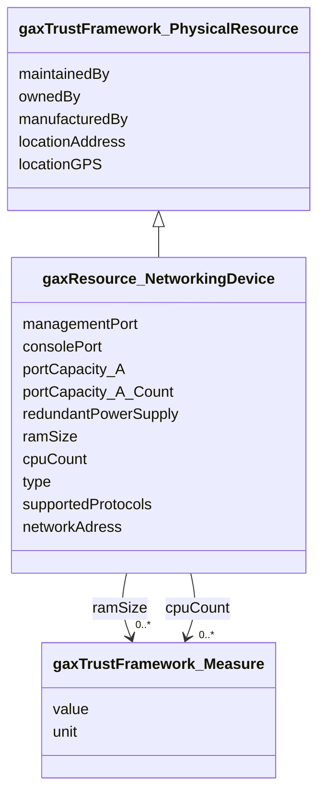
```mermaid
classDiagram

class gaxResource_NetworkingDevice{
managementPort
consolePort
portCapacity_A
portCapacity_A_Count
redundantPowerSupply
ramSize
cpuCount
type
supportedProtocols
networkAdress
}

class gaxTrustFramework_PhysicalResource{
maintainedBy
ownedBy
manufacturedBy
locationAddress
locationGPS
}

gaxTrustFramework_PhysicalResource <|-- gaxResource_NetworkingDevice

class gaxTrustFramework_Measure{
value
unit
}

gaxResource_NetworkingDevice --> "0..*" gaxTrustFramework_Measure: ramSize

gaxResource_NetworkingDevice --> "0..*" gaxTrustFramework_Measure: cpuCount


```

 **Super classes**: [gax-trust-framework:PhysicalResource](#gax-trust-framework:physicalresource)

 **Sub classes**: 

 | Title | Data Type | Min Count | Max Count | Description | Example Value | 
| ------- | ------- | ------- | ------- | ------- | ------- | 
| managementPort | xsd:string | 0 | unlimited | A dedicated port for management tasks. | no, yes | 
| consolePort | xsd:string | 0 | unlimited | A dedicated port for console tasks. | no, yes | 
| portCapacity_A | xsd:float 0 <=  value  | 0 | unlimited | The assigned capacity of ports. | 10GE, 100GE | 
| portCapacity_A_Count | xsd:integer 1 <=  value  | 0 | unlimited | The assigned number of ports. | 10, 1 | 
| redundantPowerSupply | xsd:string | 0 | unlimited | Availability of redundant power supply for the cases of emergency. | yes, no | 
| ramSize | [gax-trust-framework:Measure](#gax-trust-framework:measure) | 0 | unlimited | Ram size of the networking device | 2Gb | 
| cpuCount | [gax-trust-framework:Measure](#gax-trust-framework:measure) | 0 | unlimited | Number of available CPUs. | 1 | 
| type | xsd:string | 0 | unlimited | Type of networking device | switch, router, repeater | 
| supportedProtocols | xsd:string | 0 | unlimited | List of  supported protocols among used layers should be specified. | IP, IRP | 
| networkAdress | xsd:float | 0 | unlimited | IP address of the netowrking device | 192.168.24.2/32 | 

## gax-trust-framework:Attestation

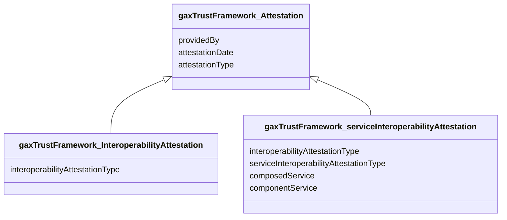
```mermaid
classDiagram

class gaxTrustFramework_Attestation{
providedBy
attestationDate
attestationType
}

class gaxTrustFramework_InteroperabilityAttestation{
interoperabilityAttestationType
}

gaxTrustFramework_Attestation <|-- gaxTrustFramework_InteroperabilityAttestation

class gaxTrustFramework_serviceInteroperabilityAttestation{
interoperabilityAttestationType
serviceInteroperabilityAttestationType
composedService
componentService
}

gaxTrustFramework_Attestation <|-- gaxTrustFramework_serviceInteroperabilityAttestation


```

 **Super classes**: 

 **Sub classes**: [gax-trust-framework:InteroperabilityAttestation](#gax-trust-framework:interoperabilityattestation), [gax-trust-framework:serviceInteroperabilityAttestation](#gax-trust-framework:serviceinteroperabilityattestation)

 | Title | Data Type | Min Count | Max Count | Description | Example Value | 
| ------- | ------- | ------- | ------- | ------- | ------- | 
| providedBy | gax-core:Participant | 1 | 1 | DID of participant providing this Attestation. | https://gaia-x.eu | 
| attestationDate | xsd:date | 1 | 1 | Date of Attestation |  | 
| attestationType | xsd:string | 1 | 1 | Type of attestation: Positive or Negative (revocation) | Positive, Negative ( Revocation ) | 

## gax-trust-framework:AutoscaledContainer

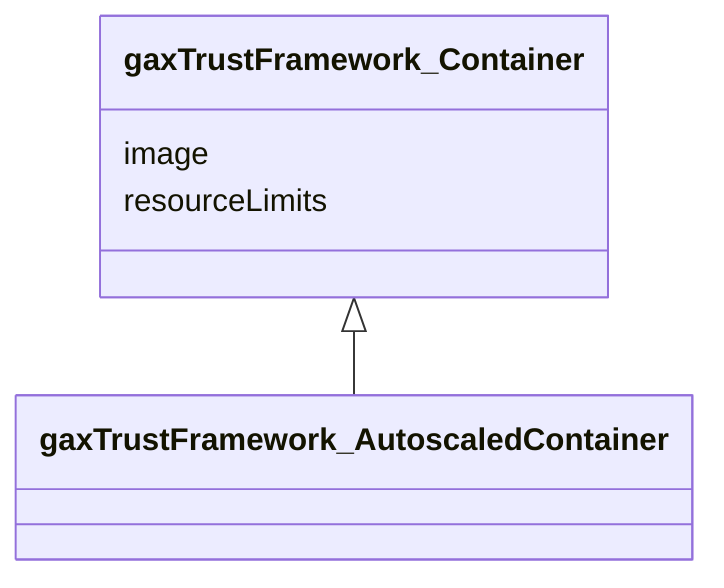
```mermaid
classDiagram

class gaxTrustFramework_Container{
image
resourceLimits
}

gaxTrustFramework_Container <|-- gaxTrustFramework_AutoscaledContainer


```

 **Super classes**: [gax-trust-framework:Container](#gax-trust-framework:container)

 **Sub classes**: 

 | Title | Data Type | Min Count | Max Count | Description | Example Value | 
| ------- | ------- | ------- | ------- | ------- | ------- | 

## gax-trust-framework:AutoscaledVirtualMachine

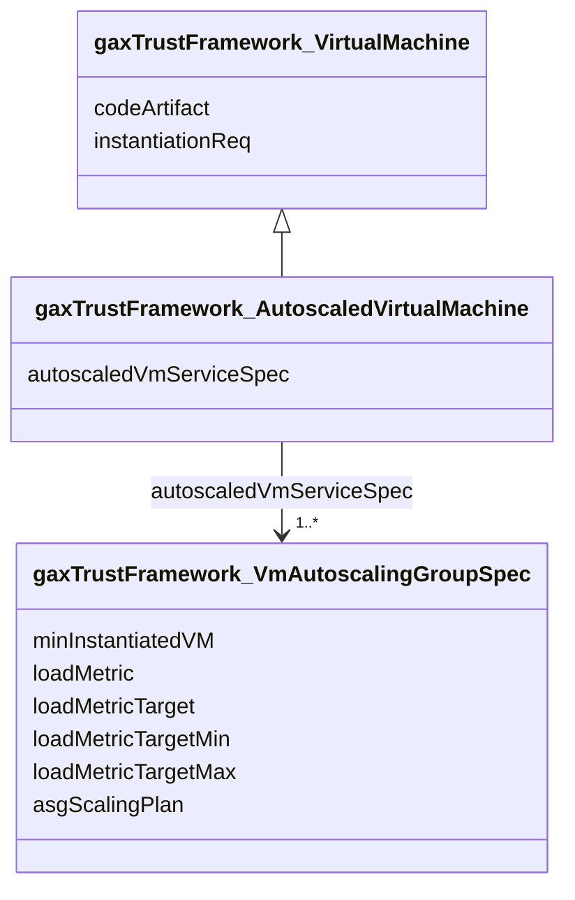
```mermaid
classDiagram

class gaxTrustFramework_AutoscaledVirtualMachine{
autoscaledVmServiceSpec
}

class gaxTrustFramework_VirtualMachine{
codeArtifact
instantiationReq
}

gaxTrustFramework_VirtualMachine <|-- gaxTrustFramework_AutoscaledVirtualMachine

class gaxTrustFramework_VmAutoscalingGroupSpec{
minInstantiatedVM
loadMetric
loadMetricTarget
loadMetricTargetMin
loadMetricTargetMax
asgScalingPlan
}

gaxTrustFramework_AutoscaledVirtualMachine --> "1..*" gaxTrustFramework_VmAutoscalingGroupSpec: autoscaledVmServiceSpec


```

 **Super classes**: [gax-trust-framework:VirtualMachine](#gax-trust-framework:virtualmachine)

 **Sub classes**: 

 | Title | Data Type | Min Count | Max Count | Description | Example Value | 
| ------- | ------- | ------- | ------- | ------- | ------- | 
| autoscaledVmServiceSpec | [gax-trust-framework:VmAutoscalingGroupSpec](#gax-trust-framework:vmautoscalinggroupspec) | 1 | unlimited | Auto Scaling Group Specifications for this service offering | (a structured object of type gax-trust-framework:VMAutoScalingGroupSpec) | 

## gax-trust-framework:AvailabilityZone

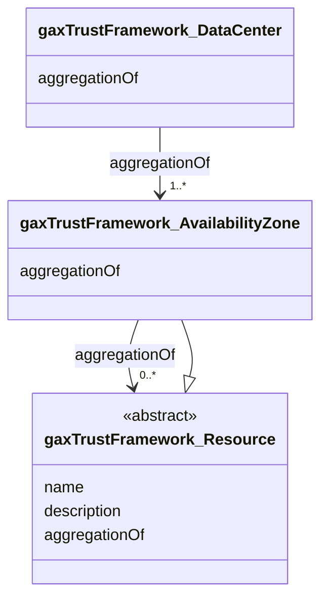
```mermaid
classDiagram

class gaxTrustFramework_AvailabilityZone{
aggregationOf
}

class gaxTrustFramework_Resource{
<<abstract>>

name
description
aggregationOf
}

gaxTrustFramework_Resource <|-- gaxTrustFramework_AvailabilityZone

gaxTrustFramework_AvailabilityZone --> "0..*" gaxTrustFramework_Resource: aggregationOf

class gaxTrustFramework_DataCenter{
aggregationOf
}

gaxTrustFramework_DataCenter --> "1..*" gaxTrustFramework_AvailabilityZone: aggregationOf


```

 **Super classes**: [gax-trust-framework:Resource](#gax-trust-framework:resource)

 **Sub classes**: 

 | Title | Data Type | Min Count | Max Count | Description | Example Value | 
| ------- | ------- | ------- | ------- | ------- | ------- | 
| aggregationOf | [gax-trust-framework:Resource](#gax-trust-framework:resource) | 0 | unlimited | an availability zone is an aggregation of resources - physical and abstract - in a non-redundant setup often associated with a single datacenter room | (reference to Resources) | 

## gax-trust-framework:BareMetal

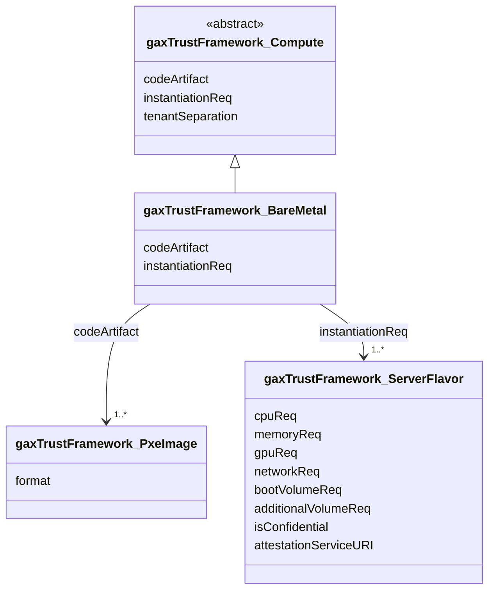
```mermaid
classDiagram

class gaxTrustFramework_BareMetal{
codeArtifact
instantiationReq
}

class gaxTrustFramework_Compute{
<<abstract>>

codeArtifact
instantiationReq
tenantSeparation
}

gaxTrustFramework_Compute <|-- gaxTrustFramework_BareMetal

class gaxTrustFramework_PxeImage{
format
}

gaxTrustFramework_BareMetal --> "1..*" gaxTrustFramework_PxeImage: codeArtifact

class gaxTrustFramework_ServerFlavor{
cpuReq
memoryReq
gpuReq
networkReq
bootVolumeReq
additionalVolumeReq
isConfidential
attestationServiceURI
}

gaxTrustFramework_BareMetal --> "1..*" gaxTrustFramework_ServerFlavor: instantiationReq


```

 **Super classes**: [gax-trust-framework:Compute](#gax-trust-framework:compute)

 **Sub classes**: 

 | Title | Data Type | Min Count | Max Count | Description | Example Value | 
| ------- | ------- | ------- | ------- | ------- | ------- | 
| codeArtifact | [gax-trust-framework:PxeImage](#gax-trust-framework:pxeimage) | 1 | unlimited | all possible provided bare metal server images for this service offering | (a structured object of type gax-trust-framework:PXEImage) | 
| instantiationReq | [gax-trust-framework:ServerFlavor](#gax-trust-framework:serverflavor) | 1 | unlimited | all possible provided bare metal server flavors for this service offering | (a structured object of type gax-trust-framework:ServerFlavor) | 

## gax-trust-framework:BigData

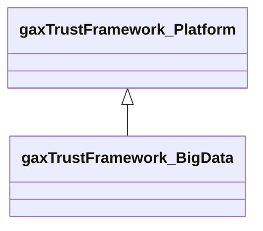
```mermaid
classDiagram

gaxTrustFramework_Platform <|-- gaxTrustFramework_BigData


```

 **Super classes**: [gax-trust-framework:Platform](#gax-trust-framework:platform)

 **Sub classes**: 

 | Title | Data Type | Min Count | Max Count | Description | Example Value | 
| ------- | ------- | ------- | ------- | ------- | ------- | 

## gax-trust-framework:BlockStorageOffering

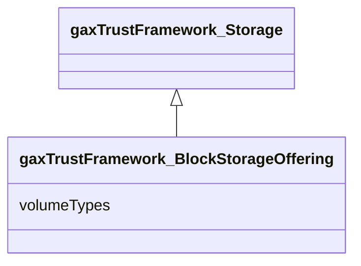
```mermaid
classDiagram

class gaxTrustFramework_BlockStorageOffering{
volumeTypes
}

gaxTrustFramework_Storage <|-- gaxTrustFramework_BlockStorageOffering


```

 **Super classes**: [gax-trust-framework:Storage](#gax-trust-framework:storage)

 **Sub classes**: 

 | Title | Data Type | Min Count | Max Count | Description | Example Value | 
| ------- | ------- | ------- | ------- | ------- | ------- | 
| volumeTypes | xsd:string | 0 | 1 | List of volume types supported by this block storage | local-fast, remote-fast, remote-standard | 

## gax-trust-framework:CPU

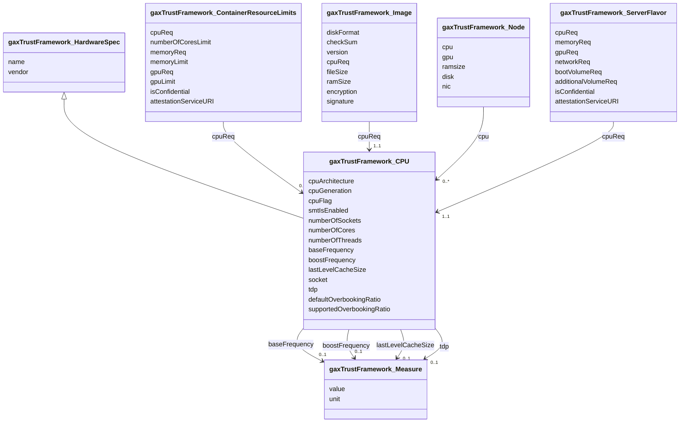
```mermaid
classDiagram

class gaxTrustFramework_CPU{
cpuArchitecture
cpuGeneration
cpuFlag
smtIsEnabled
numberOfSockets
numberOfCores
numberOfThreads
baseFrequency
boostFrequency
lastLevelCacheSize
socket
tdp
defaultOverbookingRatio
supportedOverbookingRatio
}

class gaxTrustFramework_HardwareSpec{
name
vendor
}

gaxTrustFramework_HardwareSpec <|-- gaxTrustFramework_CPU

class gaxTrustFramework_Measure{
value
unit
}

gaxTrustFramework_CPU --> "0..1" gaxTrustFramework_Measure: baseFrequency

gaxTrustFramework_CPU --> "0..1" gaxTrustFramework_Measure: boostFrequency

gaxTrustFramework_CPU --> "0..1" gaxTrustFramework_Measure: lastLevelCacheSize

gaxTrustFramework_CPU --> "0..1" gaxTrustFramework_Measure: tdp

class gaxTrustFramework_ContainerResourceLimits{
cpuReq
numberOfCoresLimit
memoryReq
memoryLimit
gpuReq
gpuLimit
isConfidential
attestationServiceURI
}

gaxTrustFramework_ContainerResourceLimits --> "0..1" gaxTrustFramework_CPU: cpuReq

class gaxTrustFramework_Image{
diskFormat
checkSum
version
cpuReq
fileSize
ramSize
encryption
signature
}

gaxTrustFramework_Image --> "1..1" gaxTrustFramework_CPU: cpuReq

class gaxTrustFramework_Node{
cpu
gpu
ramsize
disk
nic
}

gaxTrustFramework_Node --> "0..*" gaxTrustFramework_CPU: cpu

class gaxTrustFramework_ServerFlavor{
cpuReq
memoryReq
gpuReq
networkReq
bootVolumeReq
additionalVolumeReq
isConfidential
attestationServiceURI
}

gaxTrustFramework_ServerFlavor --> "1..1" gaxTrustFramework_CPU: cpuReq


```

 **Super classes**: [gax-trust-framework:HardwareSpec](#gax-trust-framework:hardwarespec)

 **Sub classes**: 

 | Title | Data Type | Min Count | Max Count | Description | Example Value | 
| ------- | ------- | ------- | ------- | ------- | ------- | 
| cpuArchitecture | xsd:string  value must be in: [x86, x86-64, RISC-V, Generic] | 0 | 1 | Basic CPU architecture. | x86, x86-64, RISC-V, Generic | 
| cpuGeneration | xsd:string  value must be in: [Skylake-Server-v4, Icelake-Server-v4, Cascadelake-Server-v4, EPYC-Milan-v1, EPYC-Rome-v2] | 0 | 1 | CPU instruction set generation. Determines basic feature set and migration compatibility. | Skylake-Server-v4, Icelake-Server-v4, Cascadelake-Server-v4, EPYC-Milan-v1, EPYC-Rome-v2 | 
| cpuFlag | xsd:string | 0 | unlimited | CPU flags as documented by lscpu and defined in https://github.com/torvalds/linux/blob/master/tools/arch/x86/include/asm/cpufeatures.h . | fpu, vme, de, pse, sse, sse2, ht, vmx, smx, sse4_1, sse4_2, avx, 3dnowprefetch, ibrs_enhanced, ept_ad, sgx, sgx_lc, md_clear, arch_capabilities, ... | 
| smtIsEnabled | xsd:boolean | 0 | 1 | Is simultaneous multithreading (SMT) or hyper threading (HT) active in this CPU? Default False. | true, false | 
| numberOfSockets | xsd:integer | 0 | 1 | Number of CPU Sockets | 1, 2, 4 | 
| numberOfCores | xsd:integer 1 <=  value  | 0 | 1 | Number of Cores of the CPU | 4, 6, 8, 12, 24 | 
| numberOfThreads | xsd:integer 1 <=  value  | 0 | 1 | Number of Threads of the CPU | 8, 12, 24 | 
| baseFrequency | [gax-trust-framework:Measure](#gax-trust-framework:measure) | 0 | 1 | Frequency of the CPU | A structure object of type measure, e.g. measure:value=3.0 and measure:unit=GHz | 
| boostFrequency | [gax-trust-framework:Measure](#gax-trust-framework:measure) | 0 | 1 | Boost frequency of the CPU | A structure object of type measure, e.g. measure:value=4.0 and measure:unit=GHz | 
| lastLevelCacheSize | [gax-trust-framework:Measure](#gax-trust-framework:measure) | 0 | 1 | Last Level Cache size of the CPU | A structure object of type measure, e.g. measure:value=38 and measure:unit=MB | 
| socket | xsd:string | 0 | 1 | Socket the CPU fits into. | FCLGA3647 | 
| tdp | [gax-trust-framework:Measure](#gax-trust-framework:measure) | 0 | 1 | CPU Thermal Design Power - ref : https://en.wikipedia.org/wiki/Thermal_design_power | A structure object of type measure, e.g. measure:value=100 and measure:unit=W | 
| defaultOverbookingRatio | xsd:float 1.0 <=  value  | 0 | 1 | a dimensionless value larger or equal to 1.0 describing the default maximum number of workloads scheduled on this CPU simultaneously | 1.0 | 
| supportedOverbookingRatio | xsd:float 1.0 <=  value  | 0 | unlimited | several dimensionless values larger or equal to 1.0 describing the available scheduler settings for the numer of simultaneously scheduled workloads on this CPU | 1.0 | 

## gax-trust-framework:Catalogue

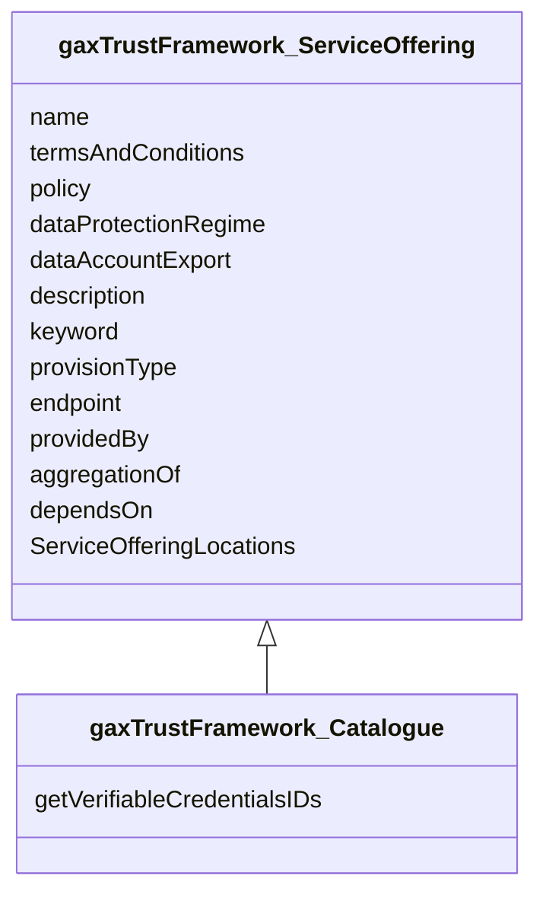
```mermaid
classDiagram

class gaxTrustFramework_Catalogue{
getVerifiableCredentialsIDs
}

class gaxTrustFramework_ServiceOffering{
name
termsAndConditions
policy
dataProtectionRegime
dataAccountExport
description
keyword
provisionType
endpoint
providedBy
aggregationOf
dependsOn
ServiceOfferingLocations
}

gaxTrustFramework_ServiceOffering <|-- gaxTrustFramework_Catalogue


```

 **Super classes**: [gax-trust-framework:ServiceOffering](#gax-trust-framework:serviceoffering)

 **Sub classes**: 

 | Title | Data Type | Min Count | Max Count | Description | Example Value | 
| ------- | ------- | ------- | ------- | ------- | ------- | 
| getVerifiableCredentialsIDs | xsd:string | 1 | unlimited | A route used to synchronize catalogues and retrieve the list of Verifiable Credentials (issuer, id). |  | 

## gax-trust-framework:Certificates

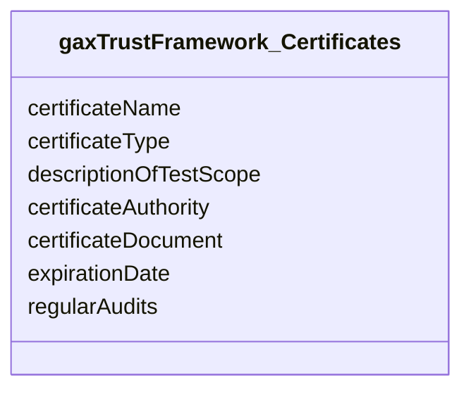
```mermaid
classDiagram

class gaxTrustFramework_Certificates{
certificateName
certificateType
descriptionOfTestScope
certificateAuthority
certificateDocument
expirationDate
regularAudits
}


```

 **Super classes**: 

 **Sub classes**: 

 | Title | Data Type | Min Count | Max Count | Description | Example Value | 
| ------- | ------- | ------- | ------- | ------- | ------- | 
| certificateName | xsd:string | 1 | 1 | Relevant certificate for the service | ISO XYZ | 
| certificateType | xsd:string | 1 | 1 | Type of the certificates | BSI IT-Grundschutz, ISO 27001, Trust in Cloud | 
| descriptionOfTestScope | xsd:string | 1 | 1 | Description of the scope of testing for this service | Freetext | 
| certificateAuthority | xsd:string | 1 | 1 | Certificate authority for this service or its certificate | TÜV Süd | 
| certificateDocument | xsd:string | 1 | 1 | Document that contains a certificate copy | certificates.pdf | 
| expirationDate | xsd:date | 1 | 1 | Date on which the certificate expires | 2122-12-21 | 
| regularAudits | xsd:boolean | 1 | 1 | Is the certificate regularly audited? | true, false | 

## gax-trust-framework:CheckSum

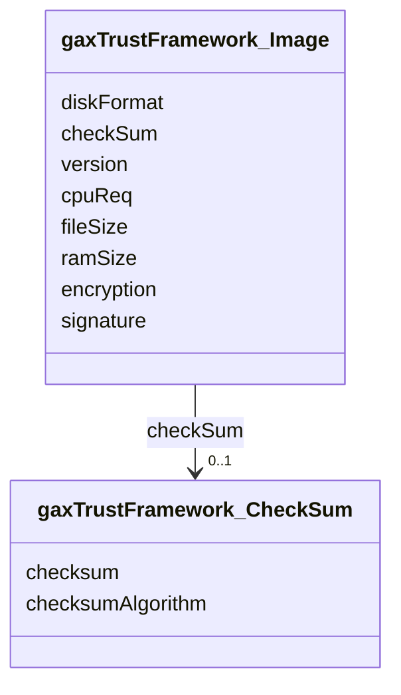
```mermaid
classDiagram

class gaxTrustFramework_CheckSum{
checksum
checksumAlgorithm
}

class gaxTrustFramework_Image{
diskFormat
checkSum
version
cpuReq
fileSize
ramSize
encryption
signature
}

gaxTrustFramework_Image --> "0..1" gaxTrustFramework_CheckSum: checkSum


```

 **Super classes**: 

 **Sub classes**: 

 | Title | Data Type | Min Count | Max Count | Description | Example Value | 
| ------- | ------- | ------- | ------- | ------- | ------- | 
| checksum | xsd:string | 1 | 1 | Value of check sum | 5d68f20237c7c01c067b577ee5e490d1 | 
| checksumAlgorithm | xsd:string  value must be in: [md5, sha-1, ripemd-160, sha-2, sha-3, blake2, blake3, other] | 1 | 1 | Defines algorithm for generating check sum | md5 | 

## gax-trust-framework:CodeArtifact

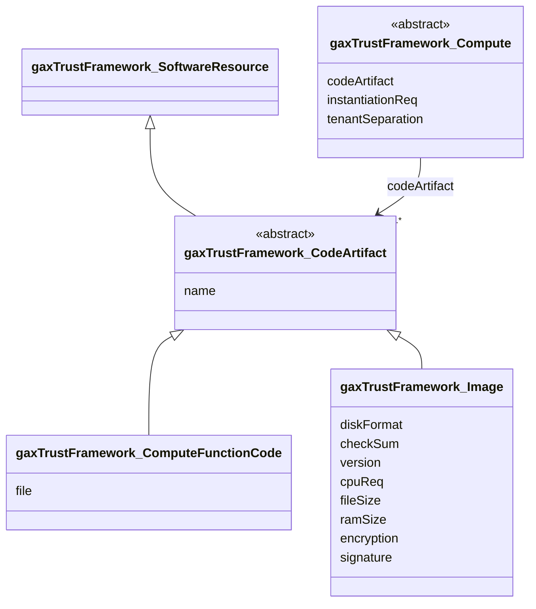
```mermaid
classDiagram

class gaxTrustFramework_CodeArtifact{
<<abstract>>

name
}

gaxTrustFramework_SoftwareResource <|-- gaxTrustFramework_CodeArtifact

class gaxTrustFramework_ComputeFunctionCode{
file
}

gaxTrustFramework_CodeArtifact <|-- gaxTrustFramework_ComputeFunctionCode

class gaxTrustFramework_Image{
diskFormat
checkSum
version
cpuReq
fileSize
ramSize
encryption
signature
}

gaxTrustFramework_CodeArtifact <|-- gaxTrustFramework_Image

class gaxTrustFramework_Compute{
<<abstract>>

codeArtifact
instantiationReq
tenantSeparation
}

gaxTrustFramework_Compute --> "1..*" gaxTrustFramework_CodeArtifact: codeArtifact


```

 **Super classes**: [gax-trust-framework:SoftwareResource](#gax-trust-framework:softwareresource)

 **Sub classes**: [gax-trust-framework:ComputeFunctionCode](#gax-trust-framework:computefunctioncode), [gax-trust-framework:Image](#gax-trust-framework:image)

 | Title | Data Type | Min Count | Max Count | Description | Example Value | 
| ------- | ------- | ------- | ------- | ------- | ------- | 
| name | xsd:string | 1 | 1 | Name identifying the code artifact | Image 1, Function_2 | 

## gax-trust-framework:ComplianceAssessmentBody

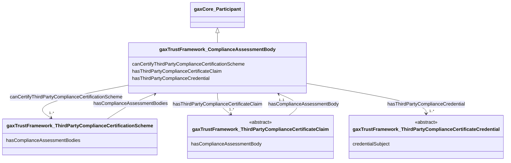
```mermaid
classDiagram

class gaxTrustFramework_ComplianceAssessmentBody{
canCertifyThirdPartyComplianceCertificationScheme
hasThirdPartyComplianceCertificateClaim
hasThirdPartyComplianceCredential
}

gaxCore_Participant <|-- gaxTrustFramework_ComplianceAssessmentBody

class gaxTrustFramework_ThirdPartyComplianceCertificationScheme{
hasComplianceAssessmentBodies
}

gaxTrustFramework_ComplianceAssessmentBody --> "1..*" gaxTrustFramework_ThirdPartyComplianceCertificationScheme: canCertifyThirdPartyComplianceCertificationScheme

class gaxTrustFramework_ThirdPartyComplianceCertificateClaim{
<<abstract>>

hasComplianceAssessmentBody
}

gaxTrustFramework_ComplianceAssessmentBody --> "1..*" gaxTrustFramework_ThirdPartyComplianceCertificateClaim: hasThirdPartyComplianceCertificateClaim

class gaxTrustFramework_ThirdPartyComplianceCertificateCredential{
<<abstract>>

credentialSubject
}

gaxTrustFramework_ComplianceAssessmentBody --> "1..*" gaxTrustFramework_ThirdPartyComplianceCertificateCredential: hasThirdPartyComplianceCredential

gaxTrustFramework_ThirdPartyComplianceCertificateClaim --> "1..1" gaxTrustFramework_ComplianceAssessmentBody: hasComplianceAssessmentBody

gaxTrustFramework_ThirdPartyComplianceCertificationScheme --> "1..*" gaxTrustFramework_ComplianceAssessmentBody: hasComplianceAssessmentBodies


```

 **Super classes**: [gax-core:Participant](#gax-core:participant)

 **Sub classes**: 

 | Title | Data Type | Min Count | Max Count | Description | Example Value | 
| ------- | ------- | ------- | ------- | ------- | ------- | 
| canCertifyThirdPartyComplianceCertificationScheme | [gax-trust-framework:ThirdPartyComplianceCertificationScheme](#gax-trust-framework:thirdpartycompliancecertificationscheme) | 1 | unlimited | IDs of the Third Party Compliance Certification Scheme this Compliance Assessment Body can certify. | did:web:compliance.gaia-x.eu/3rdPartyComplianceCertScheme/sha256#1, did:web:compliance.gaia-x.eu/3rdPartyComplianceCertScheme/sha256#2 | 
| hasThirdPartyComplianceCertificateClaim | [gax-trust-framework:ThirdPartyComplianceCertificateClaim](#gax-trust-framework:thirdpartycompliancecertificateclaim) | 1 | unlimited | IDs of Certificate claims issued by this Compliance Assessment Body. | did:web:compliance.gaia-x.eu/complianceCertClaim/sha256#1, did:web:compliance.gaia-x.eu/complianceCertClaim/sha256#2 | 
| hasThirdPartyComplianceCredential | [gax-trust-framework:ThirdPartyComplianceCertificateCredential](#gax-trust-framework:thirdpartycompliancecertificatecredential) | 1 | unlimited | IDs of the Certificate claims VC certified by this Compliance Assessment Body. | did:web:compliance.gaia-x.eu/complianceVC/sha256#1, did:web:compliance.gaia-x.eu/complianceVC/sha256#2 | 

## gax-trust-framework:ComplianceCertificateClaim

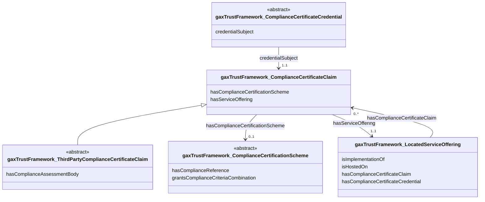
```mermaid
classDiagram

class gaxTrustFramework_ComplianceCertificateClaim{
hasComplianceCertificationScheme
hasServiceOffering
}

class gaxTrustFramework_ThirdPartyComplianceCertificateClaim{
<<abstract>>

hasComplianceAssessmentBody
}

gaxTrustFramework_ComplianceCertificateClaim <|-- gaxTrustFramework_ThirdPartyComplianceCertificateClaim

class gaxTrustFramework_ComplianceCertificationScheme{
<<abstract>>

hasComplianceReference
grantsComplianceCriteriaCombination
}

gaxTrustFramework_ComplianceCertificateClaim --> "0..1" gaxTrustFramework_ComplianceCertificationScheme: hasComplianceCertificationScheme

class gaxTrustFramework_LocatedServiceOffering{
isImplementationOf
isHostedOn
hasComplianceCertificateClaim
hasComplianceCertificateCredential
}

gaxTrustFramework_ComplianceCertificateClaim --> "1..1" gaxTrustFramework_LocatedServiceOffering: hasServiceOffering

class gaxTrustFramework_ComplianceCertificateCredential{
<<abstract>>

credentialSubject
}

gaxTrustFramework_ComplianceCertificateCredential --> "1..1" gaxTrustFramework_ComplianceCertificateClaim: credentialSubject

gaxTrustFramework_LocatedServiceOffering --> "0..*" gaxTrustFramework_ComplianceCertificateClaim: hasComplianceCertificateClaim


```

 **Super classes**: 

 **Sub classes**: [gax-trust-framework:ThirdPartyComplianceCertificateClaim](#gax-trust-framework:thirdpartycompliancecertificateclaim)

 | Title | Data Type | Min Count | Max Count | Description | Example Value | 
| ------- | ------- | ------- | ------- | ------- | ------- | 
| hasComplianceCertificationScheme | [gax-trust-framework:ComplianceCertificationScheme](#gax-trust-framework:compliancecertificationscheme) | 0 | 1 | ID of the Compliance Certification Scheme (self-description) involved in the certification | https://company-a.com/self-descriptions/compliance-cert-scheme-iso27001.jsonld | 
| hasServiceOffering | [gax-trust-framework:LocatedServiceOffering](#gax-trust-framework:locatedserviceoffering) | 1 | 1 | ID of the Service Offering (self-description) certified for the compliance | https://company-a.com/self-descriptions/service-offering-iaas.jsonld | 

## gax-trust-framework:ComplianceCertificateCredential

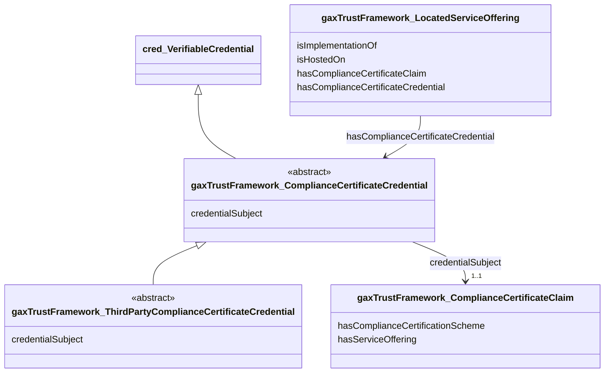
```mermaid
classDiagram

class gaxTrustFramework_ComplianceCertificateCredential{
<<abstract>>

credentialSubject
}

cred_VerifiableCredential <|-- gaxTrustFramework_ComplianceCertificateCredential

class gaxTrustFramework_ThirdPartyComplianceCertificateCredential{
<<abstract>>

credentialSubject
}

gaxTrustFramework_ComplianceCertificateCredential <|-- gaxTrustFramework_ThirdPartyComplianceCertificateCredential

class gaxTrustFramework_ComplianceCertificateClaim{
hasComplianceCertificationScheme
hasServiceOffering
}

gaxTrustFramework_ComplianceCertificateCredential --> "1..1" gaxTrustFramework_ComplianceCertificateClaim: credentialSubject

class gaxTrustFramework_LocatedServiceOffering{
isImplementationOf
isHostedOn
hasComplianceCertificateClaim
hasComplianceCertificateCredential
}

gaxTrustFramework_LocatedServiceOffering --> "0..*" gaxTrustFramework_ComplianceCertificateCredential: hasComplianceCertificateCredential


```

 **Super classes**: [cred:VerifiableCredential](#cred:verifiablecredential)

 **Sub classes**: [gax-trust-framework:ThirdPartyComplianceCertificateCredential](#gax-trust-framework:thirdpartycompliancecertificatecredential)

 | Title | Data Type | Min Count | Max Count | Description | Example Value | 
| ------- | ------- | ------- | ------- | ------- | ------- | 
| credentialSubject | [gax-trust-framework:ComplianceCertificateClaim](#gax-trust-framework:compliancecertificateclaim) | 1 | 1 | ID of the claim to be signed in a verifiable credential build with all the information that are bound in the claim. In case of third party credential the ID is the ID of the third party | https://company-a.com/self-descriptions/cab.jsonld | 

## gax-trust-framework:ComplianceCertificationScheme

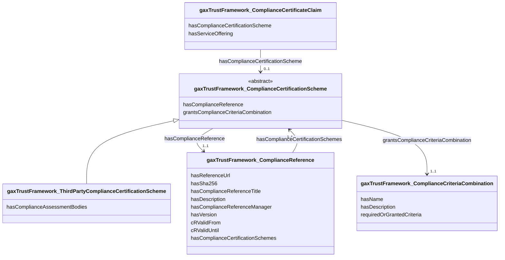
```mermaid
classDiagram

class gaxTrustFramework_ComplianceCertificationScheme{
<<abstract>>

hasComplianceReference
grantsComplianceCriteriaCombination
}

class gaxTrustFramework_ThirdPartyComplianceCertificationScheme{
hasComplianceAssessmentBodies
}

gaxTrustFramework_ComplianceCertificationScheme <|-- gaxTrustFramework_ThirdPartyComplianceCertificationScheme

class gaxTrustFramework_ComplianceReference{
hasReferenceUrl
hasSha256
hasComplianceReferenceTitle
hasDescription
hasComplianceReferenceManager
hasVersion
cRValidFrom
cRValidUntil
hasComplianceCertificationSchemes
}

gaxTrustFramework_ComplianceCertificationScheme --> "1..1" gaxTrustFramework_ComplianceReference: hasComplianceReference

class gaxTrustFramework_ComplianceCriteriaCombination{
hasName
hasDescription
requiredOrGrantedCriteria
}

gaxTrustFramework_ComplianceCertificationScheme --> "1..1" gaxTrustFramework_ComplianceCriteriaCombination: grantsComplianceCriteriaCombination

class gaxTrustFramework_ComplianceCertificateClaim{
hasComplianceCertificationScheme
hasServiceOffering
}

gaxTrustFramework_ComplianceCertificateClaim --> "0..1" gaxTrustFramework_ComplianceCertificationScheme: hasComplianceCertificationScheme

gaxTrustFramework_ComplianceReference --> "1..*" gaxTrustFramework_ComplianceCertificationScheme: hasComplianceCertificationSchemes


```

 **Super classes**: 

 **Sub classes**: [gax-trust-framework:ThirdPartyComplianceCertificationScheme](#gax-trust-framework:thirdpartycompliancecertificationscheme)

 | Title | Data Type | Min Count | Max Count | Description | Example Value | 
| ------- | ------- | ------- | ------- | ------- | ------- | 
| hasComplianceReference | [gax-trust-framework:ComplianceReference](#gax-trust-framework:compliancereference) | 1 | 1 | ID of Compliance Reference (self-description) to be certified by any means defined in the Certification Scheme | https://company-a.com/self-descriptions/compliance-ref-iso27001.jsonld | 
| grantsComplianceCriteriaCombination | [gax-trust-framework:ComplianceCriteriaCombination](#gax-trust-framework:compliancecriteriacombination) | 1 | 1 | ID of Compliance Criterion Combination granted by the scheme in case of certification | https://company-a.com/self-descriptions/compliance-ref-iso27001.jsonld | 

## gax-trust-framework:ComplianceCriteriaCombination

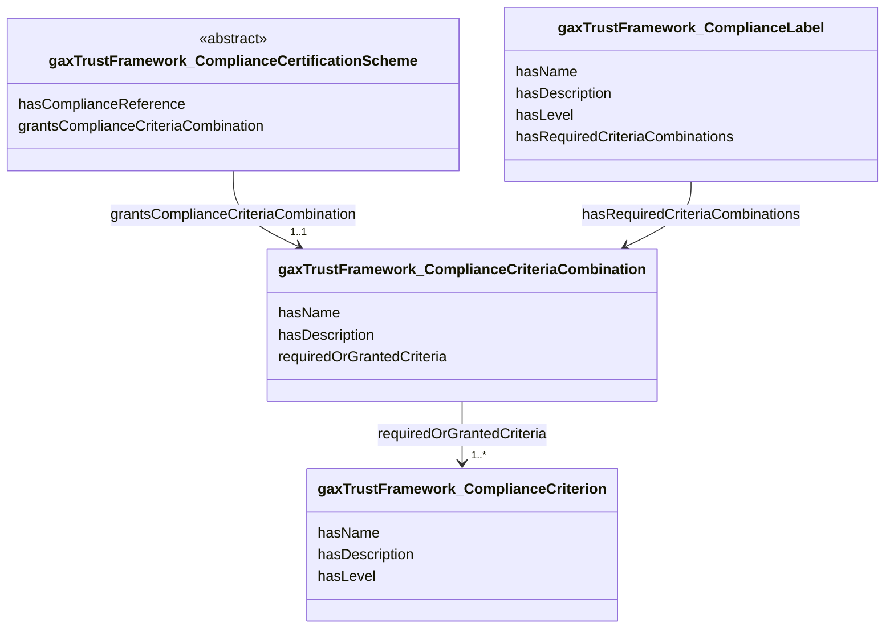
```mermaid
classDiagram

class gaxTrustFramework_ComplianceCriteriaCombination{
hasName
hasDescription
requiredOrGrantedCriteria
}

class gaxTrustFramework_ComplianceCriterion{
hasName
hasDescription
hasLevel
}

gaxTrustFramework_ComplianceCriteriaCombination --> "1..*" gaxTrustFramework_ComplianceCriterion: requiredOrGrantedCriteria

class gaxTrustFramework_ComplianceCertificationScheme{
<<abstract>>

hasComplianceReference
grantsComplianceCriteriaCombination
}

gaxTrustFramework_ComplianceCertificationScheme --> "1..1" gaxTrustFramework_ComplianceCriteriaCombination: grantsComplianceCriteriaCombination

class gaxTrustFramework_ComplianceLabel{
hasName
hasDescription
hasLevel
hasRequiredCriteriaCombinations
}

gaxTrustFramework_ComplianceLabel --> "1..*" gaxTrustFramework_ComplianceCriteriaCombination: hasRequiredCriteriaCombinations


```

 **Super classes**: 

 **Sub classes**: 

 | Title | Data Type | Min Count | Max Count | Description | Example Value | 
| ------- | ------- | ------- | ------- | ------- | ------- | 
| hasName | xsd:string | 1 | 1 | Name of the Gaia-X criteria combination | Gaia-X Criteria Combination #1 | 
| hasDescription | xsd:string | 0 | 1 | A description in natural language | Gaia-X | 
| requiredOrGrantedCriteria | [gax-trust-framework:ComplianceCriterion](#gax-trust-framework:compliancecriterion) | 1 | unlimited | List of Required Criteria to be granted for the label or list of granted Criteria by the compliance. All the Criteria have to be granted (logic AND) | 22/04 or 2022/04/12 or 1.5.34 or built 240344 | 

## gax-trust-framework:ComplianceCriterion

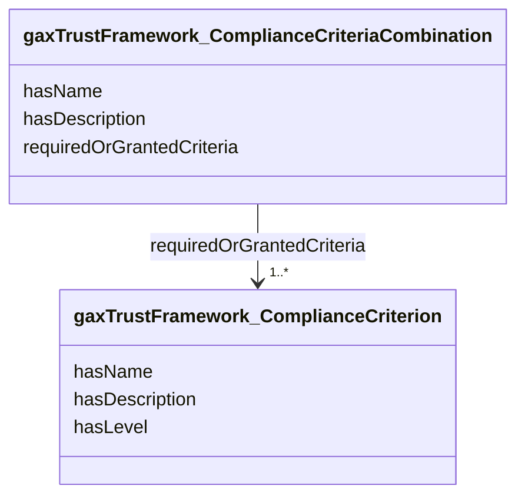
```mermaid
classDiagram

class gaxTrustFramework_ComplianceCriterion{
hasName
hasDescription
hasLevel
}

class gaxTrustFramework_ComplianceCriteriaCombination{
hasName
hasDescription
requiredOrGrantedCriteria
}

gaxTrustFramework_ComplianceCriteriaCombination --> "1..*" gaxTrustFramework_ComplianceCriterion: requiredOrGrantedCriteria


```

 **Super classes**: 

 **Sub classes**: 

 | Title | Data Type | Min Count | Max Count | Description | Example Value | 
| ------- | ------- | ------- | ------- | ------- | ------- | 
| hasName | xsd:string | 1 | 1 | Name of the Gaia-X Criterion | Gaia-X C1/L1 | 
| hasDescription | xsd:string | 0 | 1 | A description in natural language of the Gaia-X Criterion as defined in TF document | Gaia-X | 
| hasLevel | xsd:string | 1 | 1 | A description in natural language of the Label level. The level ordering is done by alphanumeric order. | 1, 2, 3 | 

## gax-trust-framework:ComplianceLabel

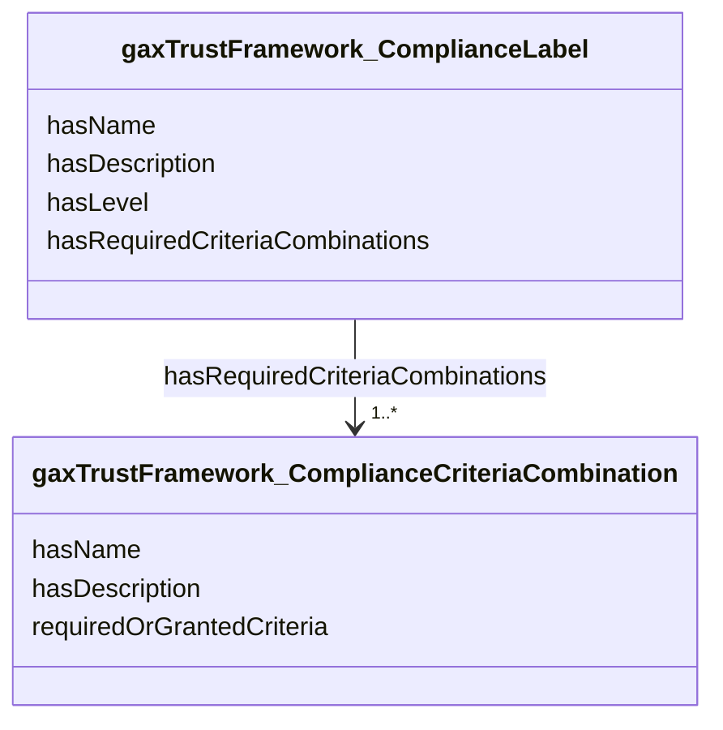
```mermaid
classDiagram

class gaxTrustFramework_ComplianceLabel{
hasName
hasDescription
hasLevel
hasRequiredCriteriaCombinations
}

class gaxTrustFramework_ComplianceCriteriaCombination{
hasName
hasDescription
requiredOrGrantedCriteria
}

gaxTrustFramework_ComplianceLabel --> "1..*" gaxTrustFramework_ComplianceCriteriaCombination: hasRequiredCriteriaCombinations


```

 **Super classes**: 

 **Sub classes**: 

 | Title | Data Type | Min Count | Max Count | Description | Example Value | 
| ------- | ------- | ------- | ------- | ------- | ------- | 
| hasName | xsd:string | 1 | 1 | Name of the Gaia-X Label | Gaia-X GDPR Trusted Label | 
| hasDescription | xsd:string | 0 | 1 | A description in natural language of the Gaia-X Label as defined in TF document | Gaia-X | 
| hasLevel | xsd:string | 1 | 1 | A description in natural language of the Gaia-X Label Level as defined in TF document | 1, 2, 3 | 
| hasRequiredCriteriaCombinations | [gax-trust-framework:ComplianceCriteriaCombination](#gax-trust-framework:compliancecriteriacombination) | 1 | unlimited | List of Criteria Combinations. If one of these Combinations is valid the Label is Granted | 1, 2, 3 | 

## gax-trust-framework:ComplianceReference

```mermaid
classDiagram

class gaxTrustFramework_ComplianceReference{
hasReferenceUrl
hasSha256
hasComplianceReferenceTitle
hasDescription
hasComplianceReferenceManager
hasVersion
cRValidFrom
cRValidUntil
hasComplianceCertificationSchemes
}

class gaxTrustFramework_ComplianceReferenceManager{
hasComplianceReferences
}

gaxTrustFramework_ComplianceReference --> "1..1" gaxTrustFramework_ComplianceReferenceManager: hasComplianceReferenceManager

class gaxTrustFramework_ComplianceCertificationScheme{
<<abstract>>

hasComplianceReference
grantsComplianceCriteriaCombination
}

gaxTrustFramework_ComplianceReference --> "1..*" gaxTrustFramework_ComplianceCertificationScheme: hasComplianceCertificationSchemes

gaxTrustFramework_ComplianceCertificationScheme --> "1..1" gaxTrustFramework_ComplianceReference: hasComplianceReference

gaxTrustFramework_ComplianceReferenceManager --> "1..*" gaxTrustFramework_ComplianceReference: hasComplianceReferences


```

 **Super classes**: 

 **Sub classes**: 

 | Title | Data Type | Min Count | Max Count | Description | Example Value | 
| ------- | ------- | ------- | ------- | ------- | ------- | 
| hasReferenceUrl | xsd:anyURI | 1 | 1 | URI to reference the content of the compliance reference in a single PDF file | https://www.iso.org/iso-27001.pdf | 
| hasSha256 | xsd:string | 1 | 1 | SHA256 of PDF document referenced by hasReferenceUrl. | ba7816bf8f01cfea414140de5dae2223b00361a396177a9cb410ff61f20015ad | 
| hasComplianceReferenceTitle | xsd:string | 1 | 1 | Name of the Compliance Reference | ISO 27001 | 
| hasDescription | xsd:string | 0 | 1 | A description in natural language | Information security management system standards. | 
| hasComplianceReferenceManager | [gax-trust-framework:ComplianceReferenceManager](#gax-trust-framework:compliancereferencemanager) | 1 | 1 | ID of Participant (self-description) in charge of managing this Compliance Reference | https://company-a.com/self-descriptions/compliance-ref-manager.jsonld | 
| hasVersion | xsd:string | 0 | 1 | versioning according to [semver](https://semver.org/). | 22/04 or 2022/04/12 or 1.5.34 or built 240344 | 
| cRValidFrom | xsd:dateTime | 0 | 1 | Indicates the first date when the compliance reference goes into effect | 22/04 or 2022/04/12 or 1.5.34 or built 240344 | 
| cRValidUntil | xsd:dateTime | 0 | 1 | Indicates the last date when the compliance reference is no more into effect | 22/04 or 2022/04/12 or 1.5.34 or built 240344 | 
| hasComplianceCertificationSchemes | [gax-trust-framework:ComplianceCertificationScheme](#gax-trust-framework:compliancecertificationscheme) | 1 | unlimited | List of schemes that grants certification. This list is managed by a reference manager. | did:web:compliance.cispe.org/coc/gdpr/thirdparty#1 | 

## gax-trust-framework:ComplianceReferenceManager

```mermaid
classDiagram

class gaxTrustFramework_ComplianceReferenceManager{
hasComplianceReferences
}

gaxCore_Participant <|-- gaxTrustFramework_ComplianceReferenceManager

class gaxTrustFramework_ComplianceReference{
hasReferenceUrl
hasSha256
hasComplianceReferenceTitle
hasDescription
hasComplianceReferenceManager
hasVersion
cRValidFrom
cRValidUntil
hasComplianceCertificationSchemes
}

gaxTrustFramework_ComplianceReferenceManager --> "1..*" gaxTrustFramework_ComplianceReference: hasComplianceReferences

gaxTrustFramework_ComplianceReference --> "1..1" gaxTrustFramework_ComplianceReferenceManager: hasComplianceReferenceManager


```

 **Super classes**: [gax-core:Participant](#gax-core:participant)

 **Sub classes**: 

 | Title | Data Type | Min Count | Max Count | Description | Example Value | 
| ------- | ------- | ------- | ------- | ------- | ------- | 
| hasComplianceReferences | [gax-trust-framework:ComplianceReference](#gax-trust-framework:compliancereference) | 1 | unlimited | Unordered list of Ids of ComplianceReferences (self-description) managed by this ComplianceReferenceManager | https://company-a.com/self-descriptions/comp-ref1.jsonld | 

## gax-trust-framework:Compute

```mermaid
classDiagram

class gaxTrustFramework_Compute{
<<abstract>>

codeArtifact
instantiationReq
tenantSeparation
}

class gaxTrustFramework_ServiceOffering{
name
termsAndConditions
policy
dataProtectionRegime
dataAccountExport
description
keyword
provisionType
endpoint
providedBy
aggregationOf
dependsOn
ServiceOfferingLocations
}

gaxTrustFramework_ServiceOffering <|-- gaxTrustFramework_Compute

class gaxTrustFramework_BareMetal{
codeArtifact
instantiationReq
}

gaxTrustFramework_Compute <|-- gaxTrustFramework_BareMetal

class gaxTrustFramework_ComputeFunction{
code
trigger
}

gaxTrustFramework_Compute <|-- gaxTrustFramework_ComputeFunction

class gaxTrustFramework_Container{
image
resourceLimits
}

gaxTrustFramework_Compute <|-- gaxTrustFramework_Container

class gaxTrustFramework_VirtualMachine{
codeArtifact
instantiationReq
}

gaxTrustFramework_Compute <|-- gaxTrustFramework_VirtualMachine

class gaxTrustFramework_CodeArtifact{
<<abstract>>

name
}

gaxTrustFramework_Compute --> "1..*" gaxTrustFramework_CodeArtifact: codeArtifact

gaxTrustFramework_Compute --> "1..*" gaxTrustFramework_InstantiationRequirements: instantiationReq


```

 **Super classes**: [gax-trust-framework:ServiceOffering](#gax-trust-framework:serviceoffering)

 **Sub classes**: [gax-trust-framework:BareMetal](#gax-trust-framework:baremetal), [gax-trust-framework:ComputeFunction](#gax-trust-framework:computefunction), [gax-trust-framework:Container](#gax-trust-framework:container), [gax-trust-framework:VirtualMachine](#gax-trust-framework:virtualmachine)

 | Title | Data Type | Min Count | Max Count | Description | Example Value | 
| ------- | ------- | ------- | ------- | ------- | ------- | 
| codeArtifact | [gax-trust-framework:CodeArtifact](#gax-trust-framework:codeartifact) | 1 | unlimited | Compute Service Code Artifacts | (a structured object of type gax-trust-framework:CodeArtifact) | 
| instantiationReq | [gax-trust-framework:InstantiationRequirements](#gax-trust-framework:instantiationrequirements) | 1 | unlimited | Set of technical Requirements / conditions to instantiate this service offering | (a structured object of type gax-trust-framework:InstantiationRequirements) | 
| tenantSeparation | xsd:string | 0 | 1 | How compute resources of different tenants are separated. Default value = hw-virtualized | hw-virtualized, sw-virtualized, os-virtualized, os-hw-virtualized, hw-partitioned, physical | 

## gax-trust-framework:ComputeFunction

```mermaid
classDiagram

class gaxTrustFramework_ComputeFunction{
code
trigger
}

class gaxTrustFramework_Compute{
<<abstract>>

codeArtifact
instantiationReq
tenantSeparation
}

gaxTrustFramework_Compute <|-- gaxTrustFramework_ComputeFunction

class gaxTrustFramework_ComputeFunctionCode{
file
}

gaxTrustFramework_ComputeFunction --> "1..*" gaxTrustFramework_ComputeFunctionCode: code

class gaxTrustFramework_ComputeFunctionTrigger{
URL
isConfidential
attestationServiceURI
}

gaxTrustFramework_ComputeFunction --> "1..*" gaxTrustFramework_ComputeFunctionTrigger: trigger


```

 **Super classes**: [gax-trust-framework:Compute](#gax-trust-framework:compute)

 **Sub classes**: 

 | Title | Data Type | Min Count | Max Count | Description | Example Value | 
| ------- | ------- | ------- | ------- | ------- | ------- | 
| code | [gax-trust-framework:ComputeFunctionCode](#gax-trust-framework:computefunctioncode) | 1 | unlimited | all possible function codes for this service offering | (a structured object of type gax-trust-framework:ComputeFunctionCode) | 
| trigger | [gax-trust-framework:ComputeFunctionTrigger](#gax-trust-framework:computefunctiontrigger) | 1 | unlimited | all possible function codes for this service offering | (a structured object of type gax-trust-framework:ComputeFunctionTrigger) | 

## gax-trust-framework:ComputeFunctionCode

```mermaid
classDiagram

class gaxTrustFramework_ComputeFunctionCode{
file
}

class gaxTrustFramework_CodeArtifact{
<<abstract>>

name
}

gaxTrustFramework_CodeArtifact <|-- gaxTrustFramework_ComputeFunctionCode

class gaxTrustFramework_ComputeFunction{
code
trigger
}

gaxTrustFramework_ComputeFunction --> "1..*" gaxTrustFramework_ComputeFunctionCode: code


```

 **Super classes**: [gax-trust-framework:CodeArtifact](#gax-trust-framework:codeartifact)

 **Sub classes**: 

 | Title | Data Type | Min Count | Max Count | Description | Example Value | 
| ------- | ------- | ------- | ------- | ------- | ------- | 
| file | xsd:anyURI | 1 | 1 | URL referring to function code file | https://storage.endpoint/image-file | 

## gax-trust-framework:ComputeFunctionTrigger

```mermaid
classDiagram

class gaxTrustFramework_ComputeFunctionTrigger{
URL
isConfidential
attestationServiceURI
}

gaxTrustFramework_InstantiationRequirements <|-- gaxTrustFramework_ComputeFunctionTrigger

class gaxTrustFramework_ComputeFunction{
code
trigger
}

gaxTrustFramework_ComputeFunction --> "1..*" gaxTrustFramework_ComputeFunctionTrigger: trigger


```

 **Super classes**: [gax-trust-framework:InstantiationRequirements](#gax-trust-framework:instantiationrequirements)

 **Sub classes**: 

 | Title | Data Type | Min Count | Max Count | Description | Example Value | 
| ------- | ------- | ------- | ------- | ------- | ------- | 
| URL | xsd:anyURI | 1 | 1 | URI / URL used to trigger this compute function | https://compute.function.endpoint | 
| isConfidential | xsd:boolean | 1 | 1 | indicates whether function is of confidential nature | false, true | 
| attestationServiceURI | xsd:anyURI | 0 | 1 | indicates whether function has an associated attestation service | https://attestation.service.endpoint | 

## gax-trust-framework:Connectivity

```mermaid
classDiagram

class gaxTrustFramework_Connectivity{
InstantiationRequirements
}

gaxTrustFramework_Infrastructure <|-- gaxTrustFramework_Connectivity

class gaxTrustFramework_LinkConnectivity{
SourceAccessPoint
DestinationAccessPoint
bandwidth
RoundTripTimeRTT
availability
packetLoss
jitter
ProtocolType
VLANType
VLANTag
VLANEtherType
}

gaxTrustFramework_Connectivity <|-- gaxTrustFramework_LinkConnectivity

class gaxTrustFramework_NetworkConnectivity{
SourceAccessPoint
DestinationAccessPoint
}

gaxTrustFramework_Connectivity <|-- gaxTrustFramework_NetworkConnectivity

class gaxTrustFramework_PhysicalConnectivity{
CircuitType
InterfaceType
SourceAccessPoint
DestinationAccessPoint
}

gaxTrustFramework_Connectivity <|-- gaxTrustFramework_PhysicalConnectivity


```

 **Super classes**: [gax-trust-framework:Infrastructure](#gax-trust-framework:infrastructure)

 **Sub classes**: [gax-trust-framework:LinkConnectivity](#gax-trust-framework:linkconnectivity), [gax-trust-framework:NetworkConnectivity](#gax-trust-framework:networkconnectivity), [gax-trust-framework:PhysicalConnectivity](#gax-trust-framework:physicalconnectivity)

 | Title | Data Type | Min Count | Max Count | Description | Example Value | 
| ------- | ------- | ------- | ------- | ------- | ------- | 
| InstantiationRequirements | xsd:string | 0 | 1 |  |  | 

## gax-trust-framework:Container

```mermaid
classDiagram

class gaxTrustFramework_Container{
image
resourceLimits
}

class gaxTrustFramework_Compute{
<<abstract>>

codeArtifact
instantiationReq
tenantSeparation
}

gaxTrustFramework_Compute <|-- gaxTrustFramework_Container

gaxTrustFramework_Container <|-- gaxTrustFramework_AutoscaledContainer

class gaxTrustFramework_ContainerImage{
baseOS
format
}

gaxTrustFramework_Container --> "1..*" gaxTrustFramework_ContainerImage: image

class gaxTrustFramework_ContainerResourceLimits{
cpuReq
numberOfCoresLimit
memoryReq
memoryLimit
gpuReq
gpuLimit
isConfidential
attestationServiceURI
}

gaxTrustFramework_Container --> "1..*" gaxTrustFramework_ContainerResourceLimits: resourceLimits


```

 **Super classes**: [gax-trust-framework:Compute](#gax-trust-framework:compute)

 **Sub classes**: [gax-trust-framework:AutoscaledContainer](#gax-trust-framework:autoscaledcontainer)

 | Title | Data Type | Min Count | Max Count | Description | Example Value | 
| ------- | ------- | ------- | ------- | ------- | ------- | 
| image | [gax-trust-framework:ContainerImage](#gax-trust-framework:containerimage) | 1 | unlimited | set of all possible provided container images for this service offering | (a structured object of type gax-trust-framework:ContainerImage) | 
| resourceLimits | [gax-trust-framework:ContainerResourceLimits](#gax-trust-framework:containerresourcelimits) | 1 | unlimited | set of all possible container resource limits for this service offering | (a structured object of type gax-trust-framework:ContainerQuota) | 

## gax-trust-framework:ContainerImage

```mermaid
classDiagram

class gaxTrustFramework_ContainerImage{
baseOS
format
}

gaxTrustFramework_WorkloadArtifact <|-- gaxTrustFramework_ContainerImage

class gaxTrustFramework_Container{
image
resourceLimits
}

gaxTrustFramework_Container --> "1..*" gaxTrustFramework_ContainerImage: image


```

 **Super classes**: [gax-trust-framework:WorkloadArtifact](#gax-trust-framework:workloadartifact)

 **Sub classes**: 

 | Title | Data Type | Min Count | Max Count | Description | Example Value | 
| ------- | ------- | ------- | ------- | ------- | ------- | 
| baseOS | xsd:string | 1 | 1 | container image base operating system | linux, windows | 
| format | xsd:string | 1 | 1 | container image format | docker v1, docker v2, oci, lxc | 

## gax-trust-framework:ContainerResourceLimits

```mermaid
classDiagram

class gaxTrustFramework_ContainerResourceLimits{
cpuReq
numberOfCoresLimit
memoryReq
memoryLimit
gpuReq
gpuLimit
isConfidential
attestationServiceURI
}

gaxTrustFramework_InstantiationRequirements <|-- gaxTrustFramework_ContainerResourceLimits

class gaxTrustFramework_CPU{
cpuArchitecture
cpuGeneration
cpuFlag
smtIsEnabled
numberOfSockets
numberOfCores
numberOfThreads
baseFrequency
boostFrequency
lastLevelCacheSize
socket
tdp
defaultOverbookingRatio
supportedOverbookingRatio
}

gaxTrustFramework_ContainerResourceLimits --> "0..1" gaxTrustFramework_CPU: cpuReq

class gaxTrustFramework_Memory{
size
memclass
rank
defaultOverbookingRatio
supportedOverbookingRatio
}

gaxTrustFramework_ContainerResourceLimits --> "0..1" gaxTrustFramework_Memory: memoryReq

gaxTrustFramework_ContainerResourceLimits --> "0..1" gaxTrustFramework_Memory: memoryLimit

class gaxTrustFramework_GPU{
gpuGeneration
memory
connection
}

gaxTrustFramework_ContainerResourceLimits --> "0..1" gaxTrustFramework_GPU: gpuReq

class gaxTrustFramework_Container{
image
resourceLimits
}

gaxTrustFramework_Container --> "1..*" gaxTrustFramework_ContainerResourceLimits: resourceLimits


```

 **Super classes**: [gax-trust-framework:InstantiationRequirements](#gax-trust-framework:instantiationrequirements)

 **Sub classes**: 

 | Title | Data Type | Min Count | Max Count | Description | Example Value | 
| ------- | ------- | ------- | ------- | ------- | ------- | 
| cpuReq | [gax-trust-framework:CPU](#gax-trust-framework:cpu) | 0 | 1 | CPU requirements | (a structured object of type gax-trust-framework:CPU) | 
| numberOfCoresLimit | xsd:integer | 0 | 1 | limit to the number of cores used by container | 2 | 
| memoryReq | [gax-trust-framework:Memory](#gax-trust-framework:memory) | 0 | 1 | container memory requirements | (a structured object of type gax-trust-framework:Memory) | 
| memoryLimit | [gax-trust-framework:Memory](#gax-trust-framework:memory) | 0 | 1 | container memory limit | (a structured object of type gax-trust-framework:Memory) | 
| gpuReq | [gax-trust-framework:GPU](#gax-trust-framework:gpu) | 0 | 1 | number of GPUs | (a structured object of type gax-trust-framework:GPU) | 
| gpuLimit | xsd:integer | 0 | 1 | GPU number limit | 1, 2 | 
| isConfidential | xsd:boolean | 1 | 1 | indicates whether container is of confidential nature | false, true | 
| attestationServiceURI | xsd:anyURI | 0 | 1 | indicates whether confidential container has an associated attestation service | https://attestation.service.endpoint | 

## gax-trust-framework:DataAccountExport

```mermaid
classDiagram

class gaxTrustFramework_DataAccountExport{
requestType
accessType
formatType
}

class gaxTrustFramework_ServiceOffering{
name
termsAndConditions
policy
dataProtectionRegime
dataAccountExport
description
keyword
provisionType
endpoint
providedBy
aggregationOf
dependsOn
ServiceOfferingLocations
}

gaxTrustFramework_ServiceOffering --> "1..*" gaxTrustFramework_DataAccountExport: dataAccountExport


```

 **Super classes**: 

 **Sub classes**: 

 | Title | Data Type | Min Count | Max Count | Description | Example Value | 
| ------- | ------- | ------- | ------- | ------- | ------- | 
| requestType | xsd:string | 1 | 1 | the mean to request data retrieval: API, email, webform, unregisteredLetter, registeredLetter, supportCenter. | API, email, webform, unregisteredLetter | 
| accessType | xsd:string | 1 | 1 | type of data support: digital, physical. | digital, physical | 
| formatType | xsd:string | 1 | 1 | type of Media Types (formerly known as MIME types) as defined by the IANA. | application/gzip, text/csv | 

## gax-trust-framework:DataCenter

```mermaid
classDiagram

class gaxTrustFramework_DataCenter{
aggregationOf
}

class gaxTrustFramework_PhysicalResource{
maintainedBy
ownedBy
manufacturedBy
locationAddress
locationGPS
}

gaxTrustFramework_PhysicalResource <|-- gaxTrustFramework_DataCenter

class gaxTrustFramework_AvailabilityZone{
aggregationOf
}

gaxTrustFramework_DataCenter --> "1..*" gaxTrustFramework_AvailabilityZone: aggregationOf

class gaxTrustFramework_Region{
aggregationOf
}

gaxTrustFramework_Region --> "1..*" gaxTrustFramework_DataCenter: aggregationOf


```

 **Super classes**: [gax-trust-framework:PhysicalResource](#gax-trust-framework:physicalresource)

 **Sub classes**: 

 | Title | Data Type | Min Count | Max Count | Description | Example Value | 
| ------- | ------- | ------- | ------- | ------- | ------- | 
| aggregationOf | [gax-trust-framework:AvailabilityZone](#gax-trust-framework:availabilityzone) | 1 | unlimited | a data center is an aggregation of availability zones | (reference to availability zone) | 

## gax-trust-framework:DataConnectorOffering

```mermaid
classDiagram

class gaxTrustFramework_DataConnectorOffering{
physicalResource
virtualResource
policies
type
creationTime
standardConformity
}

class gaxTrustFramework_ServiceOffering{
name
termsAndConditions
policy
dataProtectionRegime
dataAccountExport
description
keyword
provisionType
endpoint
providedBy
aggregationOf
dependsOn
ServiceOfferingLocations
}

gaxTrustFramework_ServiceOffering <|-- gaxTrustFramework_DataConnectorOffering

class gaxTrustFramework_PhysicalResource{
maintainedBy
ownedBy
manufacturedBy
locationAddress
locationGPS
}

gaxTrustFramework_DataConnectorOffering --> "1..*" gaxTrustFramework_PhysicalResource: physicalResource

class gaxTrustFramework_VirtualResource{
copyrightOwnedBy
license
policy
}

gaxTrustFramework_DataConnectorOffering --> "1..*" gaxTrustFramework_VirtualResource: virtualResource

class gaxTrustFramework_Standard{
title
standardReference
publisher
}

gaxTrustFramework_DataConnectorOffering --> "0..*" gaxTrustFramework_Standard: standardConformity


```

 **Super classes**: [gax-trust-framework:ServiceOffering](#gax-trust-framework:serviceoffering)

 **Sub classes**: 

 | Title | Data Type | Min Count | Max Count | Description | Example Value | 
| ------- | ------- | ------- | ------- | ------- | ------- | 
| physicalResource | [gax-trust-framework:PhysicalResource](#gax-trust-framework:physicalresource) | 1 | unlimited | a list of resource with information of where the data is located | https://gaia-x.eu | 
| virtualResource | [gax-trust-framework:VirtualResource](#gax-trust-framework:virtualresource) | 1 | unlimited | a list of resource with information of who owns the data. | https://gaia-x.eu | 
| policies | xsd:anyURI | 1 | unlimited | a list of policy expressed using a DSL used by the data connector policy engine leveraging Gaia-X Self-descriptions as both data inputs and policy inputs | https://gaia-x.eu | 
| type | xsd:string | 0 | unlimited | Type of the data asset, which helps discovery.  Preferably a controlled vocabulary entry referenced by URI | dataset, container | 
| creationTime | xsd:dateTimeStamp | 0 | unlimited | Timestamp the service has been created. | 2021-07-17T00:31:30Z | 
| standardConformity | [gax-trust-framework:Standard](#gax-trust-framework:standard) | 0 | unlimited | Provides information about applied standards. | (reference to standard | 

## gax-trust-framework:DataExport

```mermaid
classDiagram

class gaxTrustFramework_DataExport{
unlimitedAccessToCustomerData
description
}

class gaxTrustFramework_Interoperability{
technicalStandards
dataExport
technicalIntegration
requirementsServiceUsage
}

gaxTrustFramework_Interoperability --> "1..1" gaxTrustFramework_DataExport: dataExport


```

 **Super classes**: 

 **Sub classes**: 

 | Title | Data Type | Min Count | Max Count | Description | Example Value | 
| ------- | ------- | ------- | ------- | ------- | ------- | 
| unlimitedAccessToCustomerData | xsd:string  value must be in: [No statement, Export can be done after agreement, Export over documented API, Standardized APIs are offered] | 1 | 1 | Can the user access unlimited and at any time the customer data? | No statement, Export can be done after agreement, Export over documented API, Standardized APIs are offered | 
| description | xsd:string | 1 | 1 | Description of procedures for data repatriation and supported file formats? | Freetext | 

## gax-trust-framework:DataResource

```mermaid
classDiagram

class gaxTrustFramework_DataResource{
producedBy
exposedThrough
obsoleteDateTime
expirationDateTime
containsPII
legalBasis
}

class gaxTrustFramework_VirtualResource{
copyrightOwnedBy
license
policy
}

gaxTrustFramework_VirtualResource <|-- gaxTrustFramework_DataResource


```

 **Super classes**: [gax-trust-framework:VirtualResource](#gax-trust-framework:virtualresource)

 **Sub classes**: 

 | Title | Data Type | Min Count | Max Count | Description | Example Value | 
| ------- | ------- | ------- | ------- | ------- | ------- | 
| producedBy | gax-core:Participant | 1 | 1 | A resolvable link to the participant self-description legally enabling the data usage. | (a reference to gax-core:Participant object) | 
| exposedThrough | gax-core:Participant | 1 | unlimited | A resolvable link to the data exchange component that exposes the data resource. |  | 
| obsoleteDateTime | xsd:dateTime | 0 | 1 | Date time in ISO 8601 format after which data is obsolete. | 2022-10-26T21:32:52 | 
| expirationDateTime | xsd:dateTime | 0 | 1 | Date time in ISO 8601 format after which data is expired and shall be deleted. | 2022-10-26T21:32:52 | 
| containsPII | xsd:boolean | 1 | 1 | Boolean determined by Participant owning the Data Resource. | True | 
| legalBasis | xsd:string | 0 | 1 | NOTE: Mandatory if containsPII is true. One of the reasons as detailed in the identified Personal Data Protection Regimes, such as [GDPR2018]. Potential Legal Bases can be [article 6], article 7, (https://eur-lex.europa.eu/legal-content/EN/TXT/HTML/?uri=CELEX:32016R0679&from=EN#d1e1888-1-1) or article 9. It shall be expressed as a string matching 6.1.[a-f], 6.1.4, 7 or 9.2.[a-j]. (Note: this list is not final, as GDPR and Member State Law may provide for additional legal basis. Those will be implemented as options in future iterations.) | https://eur-lex.europa.eu/legal-content/EN/TXT/HTML/?uri=CELEX:32016R0679&from=EN#d1e1888-1-1 | 

## gax-trust-framework:Database

```mermaid
classDiagram

gaxTrustFramework_Platform <|-- gaxTrustFramework_Database


```

 **Super classes**: [gax-trust-framework:Platform](#gax-trust-framework:platform)

 **Sub classes**: 

 | Title | Data Type | Min Count | Max Count | Description | Example Value | 
| ------- | ------- | ------- | ------- | ------- | ------- | 

## gax-trust-framework:DigitalIdentityWallet

```mermaid
classDiagram

gaxTrustFramework_Wallet <|-- gaxTrustFramework_DigitalIdentityWallet


```

 **Super classes**: [gax-trust-framework:Wallet](#gax-trust-framework:wallet)

 **Sub classes**: 

 | Title | Data Type | Min Count | Max Count | Description | Example Value | 
| ------- | ------- | ------- | ------- | ------- | ------- | 

## gax-trust-framework:Disk

```mermaid
classDiagram

class gaxTrustFramework_Disk{
size
type
encryption
keyManagement
}

class gaxTrustFramework_HardwareSpec{
name
vendor
}

gaxTrustFramework_HardwareSpec <|-- gaxTrustFramework_Disk

class gaxTrustFramework_Measure{
value
unit
}

gaxTrustFramework_Disk --> "0..1" gaxTrustFramework_Measure: size

class gaxTrustFramework_Encryption{
encryptionAlgorithm
keyManagement
}

gaxTrustFramework_Disk --> "0..1" gaxTrustFramework_Encryption: encryption

class gaxTrustFramework_Node{
cpu
gpu
ramsize
disk
nic
}

gaxTrustFramework_Node --> "0..*" gaxTrustFramework_Disk: disk

class gaxTrustFramework_ServerFlavor{
cpuReq
memoryReq
gpuReq
networkReq
bootVolumeReq
additionalVolumeReq
isConfidential
attestationServiceURI
}

gaxTrustFramework_ServerFlavor --> "1..1" gaxTrustFramework_Disk: bootVolumeReq

gaxTrustFramework_ServerFlavor --> "0..*" gaxTrustFramework_Disk: additionalVolumeReq


```

 **Super classes**: [gax-trust-framework:HardwareSpec](#gax-trust-framework:hardwarespec)

 **Sub classes**: 

 | Title | Data Type | Min Count | Max Count | Description | Example Value | 
| ------- | ------- | ------- | ------- | ------- | ------- | 
| size | [gax-trust-framework:Measure](#gax-trust-framework:measure) | 0 | 1 | The size of that hard drive. | 1600 GB | 
| type | xsd:string | 0 | 1 | The type of that hard drive. | local SSD, local HDD, shared network storage, high-perf NVMe | 
| encryption | [gax-trust-framework:Encryption](#gax-trust-framework:encryption) | 0 | 1 | Details of disk ecryption. | (a strucctured object of type gax-trust-framework:Encryption) | 
| keyManagement | xsd:string | 1 | unlimited | Define key management method. "managed": Keys are created by and stored in key manager of cloud. "bring-your-own-key": : Keys created by user and stored in key manager of cloud. "hold-your-own-key": Key created by user and kept by user | managed, bring-your-own-key,  hold-your-own-key | 

## gax-trust-framework:Encryption

```mermaid
classDiagram

class gaxTrustFramework_Encryption{
encryptionAlgorithm
keyManagement
}

class gaxTrustFramework_Disk{
size
type
encryption
keyManagement
}

gaxTrustFramework_Disk --> "0..1" gaxTrustFramework_Encryption: encryption

class gaxTrustFramework_Image{
diskFormat
checkSum
version
cpuReq
fileSize
ramSize
encryption
signature
}

gaxTrustFramework_Image --> "0..1" gaxTrustFramework_Encryption: encryption

class gaxTrustFramework_ImageRegistryOffering{
image
encryption
privateImagesAllowed
}

gaxTrustFramework_ImageRegistryOffering --> "0..1" gaxTrustFramework_Encryption: encryption


```

 **Super classes**: 

 **Sub classes**: 

 | Title | Data Type | Min Count | Max Count | Description | Example Value | 
| ------- | ------- | ------- | ------- | ------- | ------- | 
| encryptionAlgorithm | xsd:string  value must be in: [none, rsa] | 1 | 1 | Supported algorithm used to encrypt. | none, rsa | 
| keyManagement | xsd:string  value must be in: [managed, byok, hyok] | 1 | 1 | Define key management method. "managed": Keys are created by and stored in key manager of cloud. "byok": bring-your-own-key: Keys created by user and stored in key manager of cloud. "hyok" hold-your-own-key Key created by user and kept by user | managed, byok, hyok | 

## gax-trust-framework:Endpoint

```mermaid
classDiagram

class gaxTrustFramework_Endpoint{
endPointURL
standardConformity
endpointDescription
}

class gaxTrustFramework_Standard{
title
standardReference
publisher
}

gaxTrustFramework_Endpoint --> "0..*" gaxTrustFramework_Standard: standardConformity

class gaxTrustFramework_ServiceOffering{
name
termsAndConditions
policy
dataProtectionRegime
dataAccountExport
description
keyword
provisionType
endpoint
providedBy
aggregationOf
dependsOn
ServiceOfferingLocations
}

gaxTrustFramework_ServiceOffering --> "0..*" gaxTrustFramework_Endpoint: endpoint


```

 **Super classes**: 

 **Sub classes**: 

 | Title | Data Type | Min Count | Max Count | Description | Example Value | 
| ------- | ------- | ------- | ------- | ------- | ------- | 
| endPointURL | xsd:anyURI | 0 | unlimited | The URL of the endpoint where it can be accessed | https://gaia-x.eu/ | 
| standardConformity | [gax-trust-framework:Standard](#gax-trust-framework:standard) | 0 | unlimited | Provides information about applied standards. | (reference to standard | 
| endpointDescription | xsd:anyURI | 0 | unlimited | The Description (e.g. openAPI Description) of the endpoint | https://gaia-x.eu/ | 

## gax-trust-framework:FPGA

```mermaid
classDiagram

class gaxTrustFramework_FPGA{
type
}

class gaxTrustFramework_HardwareSpec{
name
vendor
}

gaxTrustFramework_HardwareSpec <|-- gaxTrustFramework_FPGA


```

 **Super classes**: [gax-trust-framework:HardwareSpec](#gax-trust-framework:hardwarespec)

 **Sub classes**: 

 | Title | Data Type | Min Count | Max Count | Description | Example Value | 
| ------- | ------- | ------- | ------- | ------- | ------- | 
| type | xsd:string | 0 | 1 | FPGA generation. | Agilex, Stratix | 

## gax-trust-framework:FileStorageOffering

```mermaid
classDiagram

class gaxTrustFramework_FileStorageOffering{
fileSystem
}

gaxTrustFramework_Storage <|-- gaxTrustFramework_FileStorageOffering


```

 **Super classes**: [gax-trust-framework:Storage](#gax-trust-framework:storage)

 **Sub classes**: 

 | Title | Data Type | Min Count | Max Count | Description | Example Value | 
| ------- | ------- | ------- | ------- | ------- | ------- | 
| fileSystem | xsd:string  value must be in: [FAT32, NTFS, exFAT] | 0 | 1 | File system of storage service. | FAT32, NTFS, exFAT | 

## gax-trust-framework:GPU

```mermaid
classDiagram

class gaxTrustFramework_GPU{
gpuGeneration
memory
connection
}

class gaxTrustFramework_HardwareSpec{
name
vendor
}

gaxTrustFramework_HardwareSpec <|-- gaxTrustFramework_GPU

class gaxTrustFramework_Memory{
size
memclass
rank
defaultOverbookingRatio
supportedOverbookingRatio
}

gaxTrustFramework_GPU --> "0..1" gaxTrustFramework_Memory: memory

class gaxTrustFramework_ContainerResourceLimits{
cpuReq
numberOfCoresLimit
memoryReq
memoryLimit
gpuReq
gpuLimit
isConfidential
attestationServiceURI
}

gaxTrustFramework_ContainerResourceLimits --> "0..1" gaxTrustFramework_GPU: gpuReq

class gaxTrustFramework_Node{
cpu
gpu
ramsize
disk
nic
}

gaxTrustFramework_Node --> "0..*" gaxTrustFramework_GPU: gpu

class gaxTrustFramework_ServerFlavor{
cpuReq
memoryReq
gpuReq
networkReq
bootVolumeReq
additionalVolumeReq
isConfidential
attestationServiceURI
}

gaxTrustFramework_ServerFlavor --> "0..*" gaxTrustFramework_GPU: gpuReq


```

 **Super classes**: [gax-trust-framework:HardwareSpec](#gax-trust-framework:hardwarespec)

 **Sub classes**: 

 | Title | Data Type | Min Count | Max Count | Description | Example Value | 
| ------- | ------- | ------- | ------- | ------- | ------- | 
| gpuGeneration | xsd:string | 0 | 1 | GPU generation. | Fermi, Kepler, Gen9 | 
| memory | [gax-trust-framework:Memory](#gax-trust-framework:memory) | 0 | 1 | Memory of the GPU | a structure object of type Memory | 
| connection | xsd:string | 0 | 1 | Interconnection of the GPU | PCIe Gen4: 64GB/s | 

## gax-trust-framework:HardwareSpec

```mermaid
classDiagram

class gaxTrustFramework_HardwareSpec{
name
vendor
}

class gaxTrustFramework_CPU{
cpuArchitecture
cpuGeneration
cpuFlag
smtIsEnabled
numberOfSockets
numberOfCores
numberOfThreads
baseFrequency
boostFrequency
lastLevelCacheSize
socket
tdp
defaultOverbookingRatio
supportedOverbookingRatio
}

gaxTrustFramework_HardwareSpec <|-- gaxTrustFramework_CPU

class gaxTrustFramework_Disk{
size
type
encryption
keyManagement
}

gaxTrustFramework_HardwareSpec <|-- gaxTrustFramework_Disk

class gaxTrustFramework_FPGA{
type
}

gaxTrustFramework_HardwareSpec <|-- gaxTrustFramework_FPGA

class gaxTrustFramework_GPU{
gpuGeneration
memory
connection
}

gaxTrustFramework_HardwareSpec <|-- gaxTrustFramework_GPU

class gaxTrustFramework_Memory{
size
memclass
rank
defaultOverbookingRatio
supportedOverbookingRatio
}

gaxTrustFramework_HardwareSpec <|-- gaxTrustFramework_Memory

class gaxTrustFramework_Network{
nicPortReq
}

gaxTrustFramework_HardwareSpec <|-- gaxTrustFramework_Network


```

 **Super classes**: 

 **Sub classes**: [gax-trust-framework:CPU](#gax-trust-framework:cpu), [gax-trust-framework:Disk](#gax-trust-framework:disk), [gax-trust-framework:FPGA](#gax-trust-framework:fpga), [gax-trust-framework:GPU](#gax-trust-framework:gpu), [gax-trust-framework:Memory](#gax-trust-framework:memory), [gax-trust-framework:Network](#gax-trust-framework:network)

 | Title | Data Type | Min Count | Max Count | Description | Example Value | 
| ------- | ------- | ------- | ------- | ------- | ------- | 
| name | xsd:string | 0 | 1 | Procuct name of the hardware resource. | Xeon Platinum 8280 | 
| vendor | xsd:string  value must be in: [intel, AMD, NVIDEA, others] | 0 | 1 | Vendor of this hardware. | intel, AMD, NVIDEA, others | 

## gax-trust-framework:IdentityAccessManagementOffering

```mermaid
classDiagram

class gaxTrustFramework_IdentityAccessManagementOffering{
disableUserAccountDaysInactive
passwordExpiresDays
authKind
}

gaxTrustFramework_Infrastructure <|-- gaxTrustFramework_IdentityAccessManagementOffering


```

 **Super classes**: [gax-trust-framework:Infrastructure](#gax-trust-framework:infrastructure)

 **Sub classes**: 

 | Title | Data Type | Min Count | Max Count | Description | Example Value | 
| ------- | ------- | ------- | ------- | ------- | ------- | 
| disableUserAccountDaysInactive | xsd:integer 1 <=  value  | 0 | 1 | Days of account inactivity before a user account is disabled. |  | 
| passwordExpiresDays | xsd:integer 1 <=  value  | 0 | 1 | Days until a user must renew their password. This attribute is only allowed with authKind=credentials. |  | 
| authKind | xsd:string  value must be in: [credentials, ssl-cert] | 0 | 1 | Indicate, which kind of authentication is used. "credentials": Authentication with username and password. "ssl-cert": Authentication with X.509 certificates. | credentials, ssl-cert | 

## gax-trust-framework:IdentityFederation

```mermaid
classDiagram

gaxTrustFramework_IdentityAccessManagement <|-- gaxTrustFramework_IdentityFederation


```

 **Super classes**: [gax-trust-framework:IdentityAccessManagement](#gax-trust-framework:identityaccessmanagement)

 **Sub classes**: 

 | Title | Data Type | Min Count | Max Count | Description | Example Value | 
| ------- | ------- | ------- | ------- | ------- | ------- | 

## gax-trust-framework:IdentityProvider

```mermaid
classDiagram

gaxTrustFramework_IdentityAccessManagement <|-- gaxTrustFramework_IdentityProvider


```

 **Super classes**: [gax-trust-framework:IdentityAccessManagement](#gax-trust-framework:identityaccessmanagement)

 **Sub classes**: 

 | Title | Data Type | Min Count | Max Count | Description | Example Value | 
| ------- | ------- | ------- | ------- | ------- | ------- | 

## gax-trust-framework:Image

```mermaid
classDiagram

class gaxTrustFramework_Image{
diskFormat
checkSum
version
cpuReq
fileSize
ramSize
encryption
signature
}

class gaxTrustFramework_CodeArtifact{
<<abstract>>

name
}

gaxTrustFramework_CodeArtifact <|-- gaxTrustFramework_Image

class gaxTrustFramework_PxeImage{
format
}

gaxTrustFramework_Image <|-- gaxTrustFramework_PxeImage

class gaxTrustFramework_VmImage{
format
}

gaxTrustFramework_Image <|-- gaxTrustFramework_VmImage

class gaxTrustFramework_CheckSum{
checksum
checksumAlgorithm
}

gaxTrustFramework_Image --> "0..1" gaxTrustFramework_CheckSum: checkSum

class gaxTrustFramework_CPU{
cpuArchitecture
cpuGeneration
cpuFlag
smtIsEnabled
numberOfSockets
numberOfCores
numberOfThreads
baseFrequency
boostFrequency
lastLevelCacheSize
socket
tdp
defaultOverbookingRatio
supportedOverbookingRatio
}

gaxTrustFramework_Image --> "1..1" gaxTrustFramework_CPU: cpuReq

class gaxTrustFramework_Measure{
value
unit
}

gaxTrustFramework_Image --> "0..1" gaxTrustFramework_Measure: fileSize

gaxTrustFramework_Image --> "0..1" gaxTrustFramework_Measure: ramSize

class gaxTrustFramework_Encryption{
encryptionAlgorithm
keyManagement
}

gaxTrustFramework_Image --> "0..1" gaxTrustFramework_Encryption: encryption

class gaxTrustFramework_Signatur{
signatur
signatureAlgo
}

gaxTrustFramework_Image --> "0..1" gaxTrustFramework_Signatur: signature

class gaxTrustFramework_ImageRegistryOffering{
image
encryption
privateImagesAllowed
}

gaxTrustFramework_ImageRegistryOffering --> "0..1" gaxTrustFramework_Image: image


```

 **Super classes**: [gax-trust-framework:CodeArtifact](#gax-trust-framework:codeartifact)

 **Sub classes**: [gax-trust-framework:PxeImage](#gax-trust-framework:pxeimage), [gax-trust-framework:VmImage](#gax-trust-framework:vmimage)

 | Title | Data Type | Min Count | Max Count | Description | Example Value | 
| ------- | ------- | ------- | ------- | ------- | ------- | 
| diskFormat | xsd:string | 0 | 1 | Disk format. Default RAW | RAW | 
| checkSum | [gax-trust-framework:CheckSum](#gax-trust-framework:checksum) | 0 | 1 | Details on checksum of this image. | (a strucctured object of type gax-trust-framework:Checksum) | 
| version | xsd:string | 0 | 1 | Version of this image. | 8 | 
| cpuReq | [gax-trust-framework:CPU](#gax-trust-framework:cpu) | 1 | 1 | CPU requirements for this image | (a structure object of type CPU) | 
| fileSize | [gax-trust-framework:Measure](#gax-trust-framework:measure) | 0 | 1 | file size of image | (a structure object of type measure, e.g. measure:value=24 and measure:unit=GB) | 
| ramSize | [gax-trust-framework:Measure](#gax-trust-framework:measure) | 0 | 1 | size in RAM of image | (a structure object of type measure, e.g. measure:value=24 and measure:unit=GB) | 
| encryption | [gax-trust-framework:Encryption](#gax-trust-framework:encryption) | 0 | 1 | Details of image ecryption. | (a strucctured object of type gax-trust-framework:Encryption) | 
| signature | [gax-trust-framework:Signatur](#gax-trust-framework:signatur) | 0 | 1 | Details of image signatur. | (a strucctured object of type gax-trust-framework:Signatur) | 

## gax-trust-framework:ImageRegistryOffering

```mermaid
classDiagram

class gaxTrustFramework_ImageRegistryOffering{
image
encryption
privateImagesAllowed
}

gaxTrustFramework_Storage <|-- gaxTrustFramework_ImageRegistryOffering

class gaxTrustFramework_Image{
diskFormat
checkSum
version
cpuReq
fileSize
ramSize
encryption
signature
}

gaxTrustFramework_ImageRegistryOffering --> "0..1" gaxTrustFramework_Image: image

class gaxTrustFramework_Encryption{
encryptionAlgorithm
keyManagement
}

gaxTrustFramework_ImageRegistryOffering --> "0..1" gaxTrustFramework_Encryption: encryption


```

 **Super classes**: [gax-trust-framework:Storage](#gax-trust-framework:storage)

 **Sub classes**: 

 | Title | Data Type | Min Count | Max Count | Description | Example Value | 
| ------- | ------- | ------- | ------- | ------- | ------- | 
| image | [gax-trust-framework:Image](#gax-trust-framework:image) | 0 | 1 | Images available in this image registry. | (a structured object of type gax-resource:Software) | 
| encryption | [gax-trust-framework:Encryption](#gax-trust-framework:encryption) | 0 | 1 | Details on encryption capabilities of this image registry. | (a structured object of type gax-core:Encryption) | 
| privateImagesAllowed | xsd:boolean | 0 | 1 | Default: "true". "true" means that the image registry supports upload of private user images. | true, false | 

## gax-trust-framework:InfrastructureOffering

```mermaid
classDiagram

class gaxTrustFramework_ServiceOffering{
name
termsAndConditions
policy
dataProtectionRegime
dataAccountExport
description
keyword
provisionType
endpoint
providedBy
aggregationOf
dependsOn
ServiceOfferingLocations
}

gaxTrustFramework_ServiceOffering <|-- gaxTrustFramework_InfrastructureOffering


```

 **Super classes**: [gax-trust-framework:ServiceOffering](#gax-trust-framework:serviceoffering)

 **Sub classes**: 

 | Title | Data Type | Min Count | Max Count | Description | Example Value | 
| ------- | ------- | ------- | ------- | ------- | ------- | 

## gax-trust-framework:InstantiatedVirtualResource

```mermaid
classDiagram

class gaxTrustFramework_InstantiatedVirtualResource{
maintainedBy
hostedOn
instanceOf
tenantOwnedBy
serviceAccessPoint
}

class gaxTrustFramework_VirtualResource{
copyrightOwnedBy
license
policy
}

gaxTrustFramework_VirtualResource <|-- gaxTrustFramework_InstantiatedVirtualResource

class gaxTrustFramework_VirtualNode{
type
}

gaxTrustFramework_InstantiatedVirtualResource <|-- gaxTrustFramework_VirtualNode

class gaxTrustFramework_ServiceAccessPoint{
name
host
protocol
version
port
openAPI
}

gaxTrustFramework_InstantiatedVirtualResource --> "1..*" gaxTrustFramework_ServiceAccessPoint: serviceAccessPoint


```

 **Super classes**: [gax-trust-framework:VirtualResource](#gax-trust-framework:virtualresource)

 **Sub classes**: [gax-trust-framework:VirtualNode](#gax-trust-framework:virtualnode)

 | Title | Data Type | Min Count | Max Count | Description | Example Value | 
| ------- | ------- | ------- | ------- | ------- | ------- | 
| maintainedBy | gax-core:Participant | 1 | unlimited | a list of participants  maintaining the resource in operational condition. | https://gaia-x.eu | 
| hostedOn | gax-core:Resource | 1 | 1 | a resource where the instance of this virtual resource is being executed on. | https://gaia-x.eu | 
| instanceOf | gax-core:Resource | 1 | 1 | A virtual resource (normally a software resource) this process is an instance of. | https://gaia-x.eu | 
| tenantOwnedBy | gax-core:Participant | 1 | unlimited | A list of participant with contractual relation with the resource. | https://gaia-x.eu | 
| serviceAccessPoint | [gax-trust-framework:ServiceAccessPoint](#gax-trust-framework:serviceaccesspoint)  value must be in: [PD-SAP, PLME-SAP] | 1 | unlimited | a list of Service Access Point which can be an endpoint as a mean to access and interact with the resource | PD-SAP, PLME-SAP | 

## gax-trust-framework:InstantiationRequirements

```mermaid
classDiagram

gaxCore_Configuration <|-- gaxTrustFramework_InstantiationRequirements

class gaxTrustFramework_ComputeFunctionTrigger{
URL
isConfidential
attestationServiceURI
}

gaxTrustFramework_InstantiationRequirements <|-- gaxTrustFramework_ComputeFunctionTrigger

class gaxTrustFramework_ContainerResourceLimits{
cpuReq
numberOfCoresLimit
memoryReq
memoryLimit
gpuReq
gpuLimit
isConfidential
attestationServiceURI
}

gaxTrustFramework_InstantiationRequirements <|-- gaxTrustFramework_ContainerResourceLimits

class gaxTrustFramework_ServerFlavor{
cpuReq
memoryReq
gpuReq
networkReq
bootVolumeReq
additionalVolumeReq
isConfidential
attestationServiceURI
}

gaxTrustFramework_InstantiationRequirements <|-- gaxTrustFramework_ServerFlavor

class gaxTrustFramework_VmAutoscalingGroupSpec{
minInstantiatedVM
loadMetric
loadMetricTarget
loadMetricTargetMin
loadMetricTargetMax
asgScalingPlan
}

gaxTrustFramework_InstantiationRequirements <|-- gaxTrustFramework_VmAutoscalingGroupSpec

class gaxTrustFramework_Compute{
<<abstract>>

codeArtifact
instantiationReq
tenantSeparation
}

gaxTrustFramework_Compute --> "1..*" gaxTrustFramework_InstantiationRequirements: instantiationReq


```

 **Super classes**: [gax-core:Configuration](#gax-core:configuration)

 **Sub classes**: [gax-trust-framework:ComputeFunctionTrigger](#gax-trust-framework:computefunctiontrigger), [gax-trust-framework:ContainerResourceLimits](#gax-trust-framework:containerresourcelimits), [gax-trust-framework:ServerFlavor](#gax-trust-framework:serverflavor), [gax-trust-framework:VmAutoscalingGroupSpec](#gax-trust-framework:vmautoscalinggroupspec)

 | Title | Data Type | Min Count | Max Count | Description | Example Value | 
| ------- | ------- | ------- | ------- | ------- | ------- | 

## gax-trust-framework:Interconnection

```mermaid
classDiagram

class gaxTrustFramework_Interconnection{
location
interface.type
connectionPointA
connectionPointZ
bandwidth
latency
availability
packetLoss
jitter
targetPercentile
connectionType
vlanType
vlanTag
vlanEtherType
connectedNetwork_A
connectedNetwork_Z
prefixSet_A
prefixSet_Z
}

class gaxTrustFramework_Network{
nicPortReq
}

gaxTrustFramework_Network <|-- gaxTrustFramework_Interconnection

class gaxTrustFramework_Measure{
value
unit
}

gaxTrustFramework_Interconnection --> "0..*" gaxTrustFramework_Measure: bandwidth

gaxTrustFramework_Interconnection --> "0..*" gaxTrustFramework_Measure: latency

gaxTrustFramework_Interconnection --> "0..*" gaxTrustFramework_Measure: availability

gaxTrustFramework_Interconnection --> "0..*" gaxTrustFramework_Measure: packetLoss

gaxTrustFramework_Interconnection --> "0..*" gaxTrustFramework_Measure: jitter

gaxTrustFramework_Interconnection --> "0..*" gaxTrustFramework_Measure: targetPercentile

gaxTrustFramework_Interconnection --> "0..*" gaxTrustFramework_Measure: vlanTag


```

 **Super classes**: [gax-trust-framework:Network](#gax-trust-framework:network)

 **Sub classes**: 

 | Title | Data Type | Min Count | Max Count | Description | Example Value | 
| ------- | ------- | ------- | ------- | ------- | ------- | 
| location | vcard:Address | 0 | unlimited | A vcard:Address Object containing the physical location in ISO 3166-1 alpha2, alpha-3 or numeric format with at least the both ends of the connection. | (a reference to vcard:Address object) | 
| interface.type | xsd:string | 0 | unlimited | a type of physical interface | Copper cable, 5G | 
| connectionPointA | xsd:string | 0 | unlimited | The ID of the source of the connection. | a MAC address, IP address | 
| connectionPointZ | xsd:string | 0 | unlimited | The ID of the destination of the connection. | a MAC address, IP address | 
| bandwidth | [gax-trust-framework:Measure](#gax-trust-framework:measure) | 0 | unlimited | Contractual bandwidth defined in the service level agreement (SLA). Bandwidth is usually measured in dimension of bits per second. | 500 Gbps | 
| latency | [gax-trust-framework:Measure](#gax-trust-framework:measure) | 0 | unlimited | Contractual latency defined in the SLA. If not specified, then best effort is assumed. Latency is usually measured in dimension of time. | 10 seconds | 
| availability | [gax-trust-framework:Measure](#gax-trust-framework:measure) | 0 | unlimited | Contractual availability of connection defined in the SLA agreement. If not specified, then best effort is assumed. Availability is measured in the pseudo-unit "percent". | 99 percent | 
| packetLoss | [gax-trust-framework:Measure](#gax-trust-framework:measure) | 0 | unlimited | Contractual packet loss of connection defined in the SLA agreement. If not specified, then best effort is assumed. PackageLoss s measured in the pseudo-unit "percent"- | 0.00002 % | 
| jitter | [gax-trust-framework:Measure](#gax-trust-framework:measure) | 0 | unlimited | Contractual jitterdefined in the SLA. If not specified, then best effort is assumed. Jitter is measured in dimension of time. | 0.01 miliseconds | 
| targetPercentile | [gax-trust-framework:Measure](#gax-trust-framework:measure) | 0 | unlimited | Contractual percentile in the SLA. Usually referred to the nubmer of frames the SLA metrics such as availability, latency and jitter can bbe guaranteed. | 97.5%, 99% | 
| connectionType | xsd:string | 0 | unlimited | the supported types of connection, preferably specified as a controlled vocabulary entry | ethernet unicast, multicast, broadcast support | 
| vlanType | xsd:string | 0 | unlimited | the chosen types of vlan types | qinq, dot1q | 
| vlanTag | [gax-trust-framework:Measure](#gax-trust-framework:measure) | 0 | unlimited | Vlan Tag ID that range between 1 and 4094. In case qinq connection type is chosen tow vlan tag, namely outer and innter should be provided | 23, 175 | 
| vlanEtherType | xsd:string | 0 | unlimited | The ethertype of the vlan in hexadecimal notation. | 0x8100, 0x88a8 | 
| connectedNetwork_A | xsd:decimal 0 <=  value  | 0 | unlimited | autonomous system (AS) number (ASN) of the side A | 200, 714 | 
| connectedNetwork_Z | xsd:decimal 0 <=  value  | 0 | unlimited | autonomous system (AS) number (ASN) of the side Z | 200, 714 | 
| prefixSet_A | xsd:string | 0 | unlimited | CIDR Provider Identifier of network on the side A | 176.46.32.0/24 | 
| prefixSet_Z | xsd:string | 0 | unlimited | CIDR Provider Identifier of network on the side Z | 192.46.52.0/24 | 

## gax-trust-framework:InterconnectionPointIdentifier

```mermaid
classDiagram

class gaxTrustFramework_InterconnectionPointIdentifier{
dataCenterName
dataCenterFloor
DataCenterRackNumber
dataCenterPatchPanel
dataCenterPortNumber
macAddress
IPAddress
}

class gaxTrustFramework_Resource{
<<abstract>>

name
description
aggregationOf
}

gaxTrustFramework_Resource <|-- gaxTrustFramework_InterconnectionPointIdentifier


```

 **Super classes**: [gax-trust-framework:Resource](#gax-trust-framework:resource)

 **Sub classes**: 

 | Title | Data Type | Min Count | Max Count | Description | Example Value | 
| ------- | ------- | ------- | ------- | ------- | ------- | 
| dataCenterName | xsd:string | 0 | 1 | the name or Id of datacenter where the service can be accessed | Equinix FR2 - Frankfurt, North, Datacenter Leipzig Lindenau (RZW) , Equinix AM1/AM2 - Amsterdam, Luttenbergweg | 
| dataCenterFloor | xsd:string | 0 | 1 | the floor number of datacenter where the service can be accessed | 0G, 1st , 2nd | 
| DataCenterRackNumber | xsd:string | 0 | 1 | the Id of datacenter rack number where the service can be accessed | 0FM102 | 
| dataCenterPatchPanel | xsd:string | 0 | 1 | the Id of datacenter patch panel where the service can be accessed | PP102 | 
| dataCenterPortNumber | xsd:string | 0 | 1 | the port number on the patch panel where the service can be accessed | 14, 16, 25 | 
| macAddress | xsd:string | 0 | 1 | the mac address required for L2 connectivity setup | 00:00:5e:00:53:af | 
| IPAddress | xsd:string | 0 | 1 | the IP address required for L3 connectivity setup | 18.125.10.15 | 

## gax-trust-framework:Interoperability

```mermaid
classDiagram

class gaxTrustFramework_Interoperability{
technicalStandards
dataExport
technicalIntegration
requirementsServiceUsage
}

class gaxTrustFramework_TechnicalStandards{
adminstrationApiStandards
virtualizationStandards
serviceStackStandards
}

gaxTrustFramework_Interoperability --> "1..1" gaxTrustFramework_TechnicalStandards: technicalStandards

class gaxTrustFramework_DataExport{
unlimitedAccessToCustomerData
description
}

gaxTrustFramework_Interoperability --> "1..1" gaxTrustFramework_DataExport: dataExport

class gaxTrustFramework_TechnicalIntegration{
standardizedAP
description
}

gaxTrustFramework_Interoperability --> "1..1" gaxTrustFramework_TechnicalIntegration: technicalIntegration

class gaxTrustFramework_RequirementsServiceUsage{
technicalRequirements
organizationalRequirements
}

gaxTrustFramework_Interoperability --> "1..1" gaxTrustFramework_RequirementsServiceUsage: requirementsServiceUsage


```

 **Super classes**: 

 **Sub classes**: 

 | Title | Data Type | Min Count | Max Count | Description | Example Value | 
| ------- | ------- | ------- | ------- | ------- | ------- | 
| technicalStandards | [gax-trust-framework:TechnicalStandards](#gax-trust-framework:technicalstandards) | 1 | 1 | Information about technical standards the service stack is based on. | (a structured object of type TechnicalStandards) | 
| dataExport | [gax-trust-framework:DataExport](#gax-trust-framework:dataexport) | 1 | 1 | Representation of procedures of data access of customer data and data feedback. | (a structured object of type DataExport) | 
| technicalIntegration | [gax-trust-framework:TechnicalIntegration](#gax-trust-framework:technicalintegration) | 1 | 1 | Description of procedures of technical integration of service in the available IT-landscape of the user? | (a structured type of type Integration) | 
| requirementsServiceUsage | [gax-trust-framework:RequirementsServiceUsage](#gax-trust-framework:requirementsserviceusage) | 1 | 1 | Description for the technical and organizational prerequisites to use the service the user has to fulfill. | (a structured object of type RequirementsServiceUsage) | 

## gax-trust-framework:InteroperabilityAttestation

```mermaid
classDiagram

class gaxTrustFramework_InteroperabilityAttestation{
interoperabilityAttestationType
}

class gaxTrustFramework_Attestation{
providedBy
attestationDate
attestationType
}

gaxTrustFramework_Attestation <|-- gaxTrustFramework_InteroperabilityAttestation


```

 **Super classes**: [gax-trust-framework:Attestation](#gax-trust-framework:attestation)

 **Sub classes**: 

 | Title | Data Type | Min Count | Max Count | Description | Example Value | 
| ------- | ------- | ------- | ------- | ------- | ------- | 
| interoperabilityAttestationType | xsd:string | 1 | 1 | Interoperability Attestation Type | Technical, Technical and Functional | 

## gax-trust-framework:InteroperabilityAttestationType

```mermaid
classDiagram

class gaxTrustFramework_InteroperabilityAttestationType{
interoperabilityAttestationType
}


```

 **Super classes**: 

 **Sub classes**: 

 | Title | Data Type | Min Count | Max Count | Description | Example Value | 
| ------- | ------- | ------- | ------- | ------- | ------- | 
| interoperabilityAttestationType | xsd:string  value must be in: [Service Interoperability Attestation, Resource Interoperability Attestation] | 1 | 1 | Interoperability Attestation Types | Service Interoperability Attestation | 

## gax-trust-framework:LegalPerson

```mermaid
classDiagram

class gaxTrustFramework_LegalPerson{
legalName
legalForm
description
registrationNumber
legalAddress
headquarterAddress
leiCode
parentOrganization
subOrganization
}

gaxCore_Participant <|-- gaxTrustFramework_LegalPerson

http_//www.w3.org/ns/org#Organization <|-- gaxTrustFramework_LegalPerson


```

 **Super classes**: [gax-core:Participant](#gax-core:participant), [http://www.w3.org/ns/org#Organization](#http://www.w3.org/ns/org#organization)

 **Sub classes**: 

 | Title | Data Type | Min Count | Max Count | Description | Example Value | 
| ------- | ------- | ------- | ------- | ------- | ------- | 
| legalName | xsd:string | 0 | 1 | Legally binding name | ACME L.L.C | 
| legalForm | xsd:string  value must be in: [LLC, Corporation, Limited partnership (LP), Nonprofit corporation, Gesellschaft mit beschränkter Haftung (GmbH), Aktiengesellschaft (AG), Einzelunternehmen, Gesellschaft bürgerlichen Rechts (GbR), Offene Handelsgesellschaft (OHG), Kommanditgesellschaft (KG), Unternehmergesellschaft (haftungsbeschränkt), Sole Trader, Unincorporated Association, Partnership, Limited Partnership, Trust, Limited Company, Limited Liability Partnership (LLP), Community Interest Company (CIC), Charitable Incorporated Organisation (CIO), Co-operative Society (Co-op), Community Benefit Society (BenCom), other] | 0 | 1 | Legal form | L.L.C, GmbH | 
| description | xsd:string | 0 | 1 | Textual description of this organization. | A company making everything | 
| registrationNumber | xsd:string | 1 | 1 | Country’s registration number which identifies one specific entity. Valid formats are local, EUID, EORI, vatID, leiCode. | DEU1234.HRB12345 | 
| legalAddress | vcard:Address | 1 | 1 | The full legal address of the organization. | (a structured object which has the attribute country as mandatory attribute and some other optional attributes e.g., the attributes vcard:street-address,vcard:locality and vcard:country-name) | 
| headquarterAddress | vcard:Address | 1 | 1 | The full legal address of the organization. | (a structured object which has the attribute country as mandatory attribute and some other optional attributes e.g., the attributes vcard:street-address,vcard:locality and vcard:country-name) | 
| leiCode | xsd:string | 0 | 1 | Unique LEI number as defined by https://www.gleif.org. | M07J9MTYHFCSVRBV2631 | 
| parentOrganization | gax-core:Participant | 0 | unlimited | A list of direct participant that this entity is a subOrganization of, if any. | https://gaia-x.eu | 
| subOrganization | gax-core:Participant | 0 | unlimited | A list of direct participant with an legal mandate on this entity, e.g., as a subsidiary. | https://gaia-x.eu | 

## gax-trust-framework:LinkConnectivity

```mermaid
classDiagram

class gaxTrustFramework_LinkConnectivity{
SourceAccessPoint
DestinationAccessPoint
bandwidth
RoundTripTimeRTT
availability
packetLoss
jitter
ProtocolType
VLANType
VLANTag
VLANEtherType
}

class gaxTrustFramework_Connectivity{
InstantiationRequirements
}

gaxTrustFramework_Connectivity <|-- gaxTrustFramework_LinkConnectivity

class gaxTrustFramework_Measure{
value
unit
}

gaxTrustFramework_LinkConnectivity --> "0..1" gaxTrustFramework_Measure: bandwidth

gaxTrustFramework_LinkConnectivity --> "0..1" gaxTrustFramework_Measure: RoundTripTimeRTT

gaxTrustFramework_LinkConnectivity --> "0..1" gaxTrustFramework_Measure: availability

gaxTrustFramework_LinkConnectivity --> "0..1" gaxTrustFramework_Measure: packetLoss

gaxTrustFramework_LinkConnectivity --> "0..1" gaxTrustFramework_Measure: jitter

gaxTrustFramework_LinkConnectivity --> "0..1" gaxTrustFramework_Measure: VLANTag


```

 **Super classes**: [gax-trust-framework:Connectivity](#gax-trust-framework:connectivity)

 **Sub classes**: 

 | Title | Data Type | Min Count | Max Count | Description | Example Value | 
| ------- | ------- | ------- | ------- | ------- | ------- | 
| SourceAccessPoint | xsd:string | 0 | 1 | defined via interconnection point identifier of the source | FR:VLANID:56 | 
| DestinationAccessPoint | xsd:string | 0 | 1 | defined via interconnection point identifier of the destination | MUC:VLANID:24 | 
| bandwidth | [gax-trust-framework:Measure](#gax-trust-framework:measure) | 0 | 1 | Contractual bandwidth defined in the service level agreement (SLA) | 1 Gbit/s, 10 Gbit/s, 100 Gbit/s, 400 Gbit/s | 
| RoundTripTimeRTT | [gax-trust-framework:Measure](#gax-trust-framework:measure) | 0 | 1 | Contractual latency defined in the SLA. | 1 ms, 10 ms, 1 s | 
| availability | [gax-trust-framework:Measure](#gax-trust-framework:measure) | 0 | 1 | Contractual availability of connection defined in the SLA agreement. Availability is measured in the pseudo-unit "percent". | 99.9999 %, 99.9 %, 99.99 % | 
| packetLoss | [gax-trust-framework:Measure](#gax-trust-framework:measure) | 0 | 1 | Contractual packet loss of connection defined in the SLA agreement. If not specified, then best effort is assumed. PackageLoss s measured in the pseudo-unit "percent"- | 0.00002 % | 
| jitter | [gax-trust-framework:Measure](#gax-trust-framework:measure) | 0 | 1 | Contractual jitter defined in the SLA. If not specified, then best effort is assumed. | 0.01 ms, 0.002 ms | 
| ProtocolType | xsd:string | 0 | 1 | Link protocol type | Ethrnet, ARP, PPP, VLAN | 
| VLANType | xsd:string | 0 | 1 | the chosen types of vlan types | qinq, dot1q | 
| VLANTag | [gax-trust-framework:Measure](#gax-trust-framework:measure) | 0 | 1 | Vlan Tag ID that range between 1 and 4094. In case qinq connection type is chosen tow vlan tag, namely outer and innter should be provided | 23, 175 | 
| VLANEtherType | xsd:string | 0 | 1 | The ethertype of the vlan in hexadecimal notation. | 0x8100, 0x88a8 | 

## gax-trust-framework:LocatedServiceOffering

```mermaid
classDiagram

class gaxTrustFramework_LocatedServiceOffering{
isImplementationOf
isHostedOn
hasComplianceCertificateClaim
hasComplianceCertificateCredential
}

class gaxTrustFramework_ServiceOffering{
name
termsAndConditions
policy
dataProtectionRegime
dataAccountExport
description
keyword
provisionType
endpoint
providedBy
aggregationOf
dependsOn
ServiceOfferingLocations
}

gaxTrustFramework_LocatedServiceOffering --> "1..1" gaxTrustFramework_ServiceOffering: isImplementationOf

class gaxTrustFramework_Location{
<<abstract>>

hasProvider
canHostServiceOffering
hasAdministrativeLocation
hasLocatedServiceOffering
}

gaxTrustFramework_LocatedServiceOffering --> "1..1" gaxTrustFramework_Location: isHostedOn

class gaxTrustFramework_ComplianceCertificateClaim{
hasComplianceCertificationScheme
hasServiceOffering
}

gaxTrustFramework_LocatedServiceOffering --> "0..*" gaxTrustFramework_ComplianceCertificateClaim: hasComplianceCertificateClaim

class gaxTrustFramework_ComplianceCertificateCredential{
<<abstract>>

credentialSubject
}

gaxTrustFramework_LocatedServiceOffering --> "0..*" gaxTrustFramework_ComplianceCertificateCredential: hasComplianceCertificateCredential

gaxTrustFramework_ComplianceCertificateClaim --> "1..1" gaxTrustFramework_LocatedServiceOffering: hasServiceOffering

gaxTrustFramework_Location --> "1..*" gaxTrustFramework_LocatedServiceOffering: hasLocatedServiceOffering


```

 **Super classes**: 

 **Sub classes**: 

 | Title | Data Type | Min Count | Max Count | Description | Example Value | 
| ------- | ------- | ------- | ------- | ------- | ------- | 
| isImplementationOf | [gax-trust-framework:ServiceOffering](#gax-trust-framework:serviceoffering) | 1 | 1 | Id of the Service Offering referenced by this located service | did:web:example.com/serviceOffering/sha256 | 
| isHostedOn | [gax-trust-framework:Location](#gax-trust-framework:location) | 1 | 1 | Id of the Location where this located service is hosted on | did:web:example.com/location/sha256 | 
| hasComplianceCertificateClaim | [gax-trust-framework:ComplianceCertificateClaim](#gax-trust-framework:compliancecertificateclaim) | 0 | unlimited | Ids of the compliance reference claims claimed by the provider for the located service | did:web:example.com/location/sha256 | 
| hasComplianceCertificateCredential | [gax-trust-framework:ComplianceCertificateCredential](#gax-trust-framework:compliancecertificatecredential) | 0 | unlimited | Ids of the compliance reference claim claimed by the provider for the located service | did:web:example.com/location/sha256 | 

## gax-trust-framework:Location

```mermaid
classDiagram

class gaxTrustFramework_Location{
<<abstract>>

hasProvider
canHostServiceOffering
hasAdministrativeLocation
hasLocatedServiceOffering
}

class gaxTrustFramework_Provider{
hasLocations
hasServiceOffering
}

gaxTrustFramework_Location --> "1..1" gaxTrustFramework_Provider: hasProvider

class gaxTrustFramework_ServiceOffering{
name
termsAndConditions
policy
dataProtectionRegime
dataAccountExport
description
keyword
provisionType
endpoint
providedBy
aggregationOf
dependsOn
ServiceOfferingLocations
}

gaxTrustFramework_Location --> "1..*" gaxTrustFramework_ServiceOffering: canHostServiceOffering

class gaxTrustFramework_LocatedServiceOffering{
isImplementationOf
isHostedOn
hasComplianceCertificateClaim
hasComplianceCertificateCredential
}

gaxTrustFramework_Location --> "1..*" gaxTrustFramework_LocatedServiceOffering: hasLocatedServiceOffering

gaxTrustFramework_LocatedServiceOffering --> "1..1" gaxTrustFramework_Location: isHostedOn

gaxTrustFramework_Provider --> "0..*" gaxTrustFramework_Location: hasLocations


```

 **Super classes**: 

 **Sub classes**: 

 | Title | Data Type | Min Count | Max Count | Description | Example Value | 
| ------- | ------- | ------- | ------- | ------- | ------- | 
| hasProvider | [gax-trust-framework:Provider](#gax-trust-framework:provider) | 1 | 1 | Id of the participant who operates the Location Unit that implements the Service Offering | did:web:example.com/location/sha256 | 
| canHostServiceOffering | [gax-trust-framework:ServiceOffering](#gax-trust-framework:serviceoffering) | 1 | unlimited | List of references of Service Offering that may be hosted on this location | did:web:example.com/serviceOffering/sha256-1, did:web:example.com/serviceOffering/sha256-2 | 
| hasAdministrativeLocation | xsd:string | 1 | 1 | ISO 3166-2 5 digit string for location | FR-39, DE-BE | 
| hasLocatedServiceOffering | [gax-trust-framework:LocatedServiceOffering](#gax-trust-framework:locatedserviceoffering) | 1 | unlimited | Ids of Located Service Offerings on this location | did:web:example.com/locatedServiceOffering/sha256 | 

## gax-trust-framework:Measure

```mermaid
classDiagram

class gaxTrustFramework_Measure{
value
unit
}

class gaxResource_NetworkingDevice{
managementPort
consolePort
portCapacity_A
portCapacity_A_Count
redundantPowerSupply
ramSize
cpuCount
type
supportedProtocols
networkAdress
}

gaxResource_NetworkingDevice --> "0..*" gaxTrustFramework_Measure: ramSize

gaxResource_NetworkingDevice --> "0..*" gaxTrustFramework_Measure: cpuCount

class gaxTrustFramework_CPU{
cpuArchitecture
cpuGeneration
cpuFlag
smtIsEnabled
numberOfSockets
numberOfCores
numberOfThreads
baseFrequency
boostFrequency
lastLevelCacheSize
socket
tdp
defaultOverbookingRatio
supportedOverbookingRatio
}

gaxTrustFramework_CPU --> "0..1" gaxTrustFramework_Measure: baseFrequency

gaxTrustFramework_CPU --> "0..1" gaxTrustFramework_Measure: boostFrequency

gaxTrustFramework_CPU --> "0..1" gaxTrustFramework_Measure: lastLevelCacheSize

gaxTrustFramework_CPU --> "0..1" gaxTrustFramework_Measure: tdp

class gaxTrustFramework_Disk{
size
type
encryption
keyManagement
}

gaxTrustFramework_Disk --> "0..1" gaxTrustFramework_Measure: size

class gaxTrustFramework_Image{
diskFormat
checkSum
version
cpuReq
fileSize
ramSize
encryption
signature
}

gaxTrustFramework_Image --> "0..1" gaxTrustFramework_Measure: fileSize

gaxTrustFramework_Image --> "0..1" gaxTrustFramework_Measure: ramSize

class gaxTrustFramework_Interconnection{
location
interface.type
connectionPointA
connectionPointZ
bandwidth
latency
availability
packetLoss
jitter
targetPercentile
connectionType
vlanType
vlanTag
vlanEtherType
connectedNetwork_A
connectedNetwork_Z
prefixSet_A
prefixSet_Z
}

gaxTrustFramework_Interconnection --> "0..*" gaxTrustFramework_Measure: bandwidth

gaxTrustFramework_Interconnection --> "0..*" gaxTrustFramework_Measure: latency

gaxTrustFramework_Interconnection --> "0..*" gaxTrustFramework_Measure: availability

gaxTrustFramework_Interconnection --> "0..*" gaxTrustFramework_Measure: packetLoss

gaxTrustFramework_Interconnection --> "0..*" gaxTrustFramework_Measure: jitter

gaxTrustFramework_Interconnection --> "0..*" gaxTrustFramework_Measure: targetPercentile

gaxTrustFramework_Interconnection --> "0..*" gaxTrustFramework_Measure: vlanTag

class gaxTrustFramework_LinkConnectivity{
SourceAccessPoint
DestinationAccessPoint
bandwidth
RoundTripTimeRTT
availability
packetLoss
jitter
ProtocolType
VLANType
VLANTag
VLANEtherType
}

gaxTrustFramework_LinkConnectivity --> "0..1" gaxTrustFramework_Measure: bandwidth

gaxTrustFramework_LinkConnectivity --> "0..1" gaxTrustFramework_Measure: RoundTripTimeRTT

gaxTrustFramework_LinkConnectivity --> "0..1" gaxTrustFramework_Measure: availability

gaxTrustFramework_LinkConnectivity --> "0..1" gaxTrustFramework_Measure: packetLoss

gaxTrustFramework_LinkConnectivity --> "0..1" gaxTrustFramework_Measure: jitter

gaxTrustFramework_LinkConnectivity --> "0..1" gaxTrustFramework_Measure: VLANTag

class gaxTrustFramework_Memory{
size
memclass
rank
defaultOverbookingRatio
supportedOverbookingRatio
}

gaxTrustFramework_Memory --> "0..1" gaxTrustFramework_Measure: size

class gaxTrustFramework_Node{
cpu
gpu
ramsize
disk
nic
}

gaxTrustFramework_Node --> "0..*" gaxTrustFramework_Measure: ramsize

gaxTrustFramework_Node --> "0..*" gaxTrustFramework_Measure: nic

class gaxTrustFramework_Volume{
size
type
}

gaxTrustFramework_Volume --> "0..1" gaxTrustFramework_Measure: size


```

 **Super classes**: 

 **Sub classes**: 

 | Title | Data Type | Min Count | Max Count | Description | Example Value | 
| ------- | ------- | ------- | ------- | ------- | ------- | 
| value | xsd:float | 1 | 1 | The value of this measurement. | 100 | 
| unit | xsd:string | 1 | 1 | The unit of this measurement | Gbps, Euro | 

## gax-trust-framework:Memory

```mermaid
classDiagram

class gaxTrustFramework_Memory{
size
memclass
rank
defaultOverbookingRatio
supportedOverbookingRatio
}

class gaxTrustFramework_HardwareSpec{
name
vendor
}

gaxTrustFramework_HardwareSpec <|-- gaxTrustFramework_Memory

class gaxTrustFramework_Measure{
value
unit
}

gaxTrustFramework_Memory --> "0..1" gaxTrustFramework_Measure: size

class gaxTrustFramework_ContainerResourceLimits{
cpuReq
numberOfCoresLimit
memoryReq
memoryLimit
gpuReq
gpuLimit
isConfidential
attestationServiceURI
}

gaxTrustFramework_ContainerResourceLimits --> "0..1" gaxTrustFramework_Memory: memoryReq

gaxTrustFramework_ContainerResourceLimits --> "0..1" gaxTrustFramework_Memory: memoryLimit

class gaxTrustFramework_GPU{
gpuGeneration
memory
connection
}

gaxTrustFramework_GPU --> "0..1" gaxTrustFramework_Memory: memory

class gaxTrustFramework_ServerFlavor{
cpuReq
memoryReq
gpuReq
networkReq
bootVolumeReq
additionalVolumeReq
isConfidential
attestationServiceURI
}

gaxTrustFramework_ServerFlavor --> "1..1" gaxTrustFramework_Memory: memoryReq


```

 **Super classes**: [gax-trust-framework:HardwareSpec](#gax-trust-framework:hardwarespec)

 **Sub classes**: 

 | Title | Data Type | Min Count | Max Count | Description | Example Value | 
| ------- | ------- | ------- | ------- | ------- | ------- | 
| size | [gax-trust-framework:Measure](#gax-trust-framework:measure) | 0 | 1 | Memory of the GPU | a structure object of type measure, e.g. measure:value=24 and measure:unit=GB | 
| memclass | xsd:string | 0 | 1 | Memory class | DDR4, DDR5, GDDR5, GDDR6 | 
| rank | xsd:string | 0 | 1 | DIMM Type | 1R RDIMM, 2R RDIMM, 4R LRDIMM, 8R LRDIMM | 
| defaultOverbookingRatio | xsd:float 1.0 <=  value  | 0 | 1 | a dimensionless value larger or equal to 1.0 describing the default overbooking ratio on this memory | 1.0 | 
| supportedOverbookingRatio | xsd:float 1.0 <=  value  | 0 | unlimited | several dimensionless values larger or equal to 1.0 describing the available overbooking ratios on this memory | 1.0 | 

## gax-trust-framework:Network

```mermaid
classDiagram

class gaxTrustFramework_Network{
nicPortReq
}

class gaxTrustFramework_HardwareSpec{
name
vendor
}

gaxTrustFramework_HardwareSpec <|-- gaxTrustFramework_Network

class gaxTrustFramework_Interconnection{
location
interface.type
connectionPointA
connectionPointZ
bandwidth
latency
availability
packetLoss
jitter
targetPercentile
connectionType
vlanType
vlanTag
vlanEtherType
connectedNetwork_A
connectedNetwork_Z
prefixSet_A
prefixSet_Z
}

gaxTrustFramework_Network <|-- gaxTrustFramework_Interconnection

class gaxTrustFramework_ServerFlavor{
cpuReq
memoryReq
gpuReq
networkReq
bootVolumeReq
additionalVolumeReq
isConfidential
attestationServiceURI
}

gaxTrustFramework_ServerFlavor --> "1..*" gaxTrustFramework_Network: networkReq


```

 **Super classes**: [gax-trust-framework:HardwareSpec](#gax-trust-framework:hardwarespec)

 **Sub classes**: [gax-trust-framework:Interconnection](#gax-trust-framework:interconnection)

 | Title | Data Type | Min Count | Max Count | Description | Example Value | 
| ------- | ------- | ------- | ------- | ------- | ------- | 
| nicPortReq | xsd:string | 0 | 1 | placeholder for networking |  | 

## gax-trust-framework:NetworkConnectivity

```mermaid
classDiagram

class gaxTrustFramework_NetworkConnectivity{
SourceAccessPoint
DestinationAccessPoint
}

class gaxTrustFramework_Connectivity{
InstantiationRequirements
}

gaxTrustFramework_Connectivity <|-- gaxTrustFramework_NetworkConnectivity


```

 **Super classes**: [gax-trust-framework:Connectivity](#gax-trust-framework:connectivity)

 **Sub classes**: 

 | Title | Data Type | Min Count | Max Count | Description | Example Value | 
| ------- | ------- | ------- | ------- | ------- | ------- | 
| SourceAccessPoint | xsd:string | 0 | 1 | defined via interconnection point identifier of the source | Global:IANA:18.125.20.15/32 | 
| DestinationAccessPoint | xsd:string | 0 | 1 | defined via interconnection point identifier of the destination and references a network | Global:IANA:18.125.10.15/24 | 

## gax-trust-framework:NetworkOffering

```mermaid
classDiagram

class gaxTrustFramework_NetworkOffering{
serviceType
publicIpAddressProvisioning
ipVersion
tenantSeparation
}

gaxTrustFramework_Infrastructure <|-- gaxTrustFramework_NetworkOffering


```

 **Super classes**: [gax-trust-framework:Infrastructure](#gax-trust-framework:infrastructure)

 **Sub classes**: 

 | Title | Data Type | Min Count | Max Count | Description | Example Value | 
| ------- | ------- | ------- | ------- | ------- | ------- | 
| serviceType | xsd:string  value must be in: [virtual, bare-metal, mixed] | 0 | 1 | Type of Service Offering. Choose one of the following: virtual, bare-metal, mixed | virtual, bare-metal, mixed | 
| publicIpAddressProvisioning | xsd:string  value must be in: [floating, fixed, provider-network] | 0 | 1 | Defines how public IP address are provided. Floating: floating ips are supported . | floating, fixed, provider-network | 
| ipVersion | xsd:string  value must be in: [ipV6, IPv4] | 0 | 1 | Version of IP address supported. IPv4: only ipV4 addresses are supported. IPv6: both version iIPV4 and IPv6 are supported. | IPV6, IPv4 | 
| tenantSeparation | xsd:string  value must be in: [virtual, physical] | 0 | 1 | Default: virtual. How networks of different tenants are separated. | virtual, physical | 

## gax-trust-framework:Node

```mermaid
classDiagram

class gaxTrustFramework_Node{
cpu
gpu
ramsize
disk
nic
}

gaxTrustFramework_Node <|-- gaxTrustFramework_PhysicalNode

class gaxTrustFramework_PhysicalServer{
supportedManagementProtocols
managementInterface
}

gaxTrustFramework_Node <|-- gaxTrustFramework_PhysicalServer

class gaxTrustFramework_VirtualNode{
type
}

gaxTrustFramework_Node <|-- gaxTrustFramework_VirtualNode

class gaxTrustFramework_CPU{
cpuArchitecture
cpuGeneration
cpuFlag
smtIsEnabled
numberOfSockets
numberOfCores
numberOfThreads
baseFrequency
boostFrequency
lastLevelCacheSize
socket
tdp
defaultOverbookingRatio
supportedOverbookingRatio
}

gaxTrustFramework_Node --> "0..*" gaxTrustFramework_CPU: cpu

class gaxTrustFramework_GPU{
gpuGeneration
memory
connection
}

gaxTrustFramework_Node --> "0..*" gaxTrustFramework_GPU: gpu

class gaxTrustFramework_Measure{
value
unit
}

gaxTrustFramework_Node --> "0..*" gaxTrustFramework_Measure: ramsize

class gaxTrustFramework_Disk{
size
type
encryption
keyManagement
}

gaxTrustFramework_Node --> "0..*" gaxTrustFramework_Disk: disk

gaxTrustFramework_Node --> "0..*" gaxTrustFramework_Measure: nic


```

 **Super classes**: 

 **Sub classes**: [gax-trust-framework:PhysicalNode](#gax-trust-framework:physicalnode), [gax-trust-framework:PhysicalServer](#gax-trust-framework:physicalserver), [gax-trust-framework:VirtualNode](#gax-trust-framework:virtualnode)

 | Title | Data Type | Min Count | Max Count | Description | Example Value | 
| ------- | ------- | ------- | ------- | ------- | ------- | 
| cpu | [gax-trust-framework:CPU](#gax-trust-framework:cpu) | 0 | unlimited | Description of CPU(s) of this node | a structured object of type cpu, e.g. CPU:numberOfCores=4, CPU:frequency:value=3.0 and CPU:frequency:measure:unit=GHz | 
| gpu | [gax-trust-framework:GPU](#gax-trust-framework:gpu) | 0 | unlimited | Description of GPU(s) of this node. | a structured object of type gpu, e.g. GPU:memoryType=DDR6, GPU:memorySize:value=24 and GPU:memorySize:value:unit=GB | 
| ramsize | [gax-trust-framework:Measure](#gax-trust-framework:measure) | 0 | unlimited | Size of RAM of this node | a structured object of type measure, e.g. measure:value=950 and measure:unit=GB | 
| disk | [gax-trust-framework:Disk](#gax-trust-framework:disk) | 0 | unlimited | Description of disk(s) of this nodes | a structured object of type harddrive, e.g. harddrive:productid=6CX68AV, and harddrive:name=Xeon Platinum 8280,and harddrive:manufacture=NVIDA; harddrive:size:value=1000, harddrive:size:unit=GB, and harddrive:type=SSD | 
| nic | [gax-trust-framework:Measure](#gax-trust-framework:measure) | 0 | unlimited | Description of network interface card(s) of this node | a structured object of type measure, e.g. measure:value=10 and measure:unit=GBase-T | 

## gax-trust-framework:ObjectStorageOffering

```mermaid
classDiagram

class gaxTrustFramework_ObjectStorageOffering{
fileSystem
}

gaxTrustFramework_Storage <|-- gaxTrustFramework_ObjectStorageOffering


```

 **Super classes**: [gax-trust-framework:Storage](#gax-trust-framework:storage)

 **Sub classes**: 

 | Title | Data Type | Min Count | Max Count | Description | Example Value | 
| ------- | ------- | ------- | ------- | ------- | ------- | 
| fileSystem | xsd:string  value must be in: [FAT32, FAT16, exFAT, HFS+, APFS, ext4, ext3, ext2, NTFS] | 0 | 1 | File system of storage services provides. | FAT32, FAT16, exFAT, HFS+, APFS, ext4, ext3, ext2, NTFS | 

## gax-trust-framework:Orchestration

```mermaid
classDiagram

class gaxTrustFramework_Orchestration{
type
}

gaxTrustFramework_Platform <|-- gaxTrustFramework_Orchestration


```

 **Super classes**: [gax-trust-framework:Platform](#gax-trust-framework:platform)

 **Sub classes**: 

 | Title | Data Type | Min Count | Max Count | Description | Example Value | 
| ------- | ------- | ------- | ------- | ------- | ------- | 
| type | xsd:string  value must be in: [Docker Swarm, Apache Mesos, Kubernetes] | 0 | 1 | Type of this Orchestration Service Offering, such as kubernetes. | Docker Swarm, Apache Mesos, Kubernetes | 

## gax-trust-framework:PhysicalConnectivity

```mermaid
classDiagram

class gaxTrustFramework_PhysicalConnectivity{
CircuitType
InterfaceType
SourceAccessPoint
DestinationAccessPoint
}

class gaxTrustFramework_Connectivity{
InstantiationRequirements
}

gaxTrustFramework_Connectivity <|-- gaxTrustFramework_PhysicalConnectivity


```

 **Super classes**: [gax-trust-framework:Connectivity](#gax-trust-framework:connectivity)

 **Sub classes**: 

 | Title | Data Type | Min Count | Max Count | Description | Example Value | 
| ------- | ------- | ------- | ------- | ------- | ------- | 
| CircuitType | xsd:string | 0 | 1 | type of access medium: wired medium access or wireless medium access | single mode fibre or copper cable, laser, mobile network or satellite | 
| InterfaceType | xsd:string | 0 | 1 | for the chosen circuit type, one should know the interface type in case the interoperability is required | optical cable interface SR  | 
| SourceAccessPoint | xsd:string | 0 | 1 | defined via interconnection point identifier of the source | Physical:DE:EQIX:FR2:0G:0FM102:PP102:14 | 
| DestinationAccessPoint | xsd:string | 0 | 1 | defined via interconnection point identifier of the destination | Physical:DE:DE-CIX:FR4:1G:0FM102:PP102:24 | 

## gax-trust-framework:PhysicalNode

```mermaid
classDiagram

class gaxTrustFramework_Node{
cpu
gpu
ramsize
disk
nic
}

gaxTrustFramework_Node <|-- gaxTrustFramework_PhysicalNode

class gaxTrustFramework_PhysicalResource{
maintainedBy
ownedBy
manufacturedBy
locationAddress
locationGPS
}

gaxTrustFramework_PhysicalResource <|-- gaxTrustFramework_PhysicalNode


```

 **Super classes**: [gax-trust-framework:Node](#gax-trust-framework:node), [gax-trust-framework:PhysicalResource](#gax-trust-framework:physicalresource)

 **Sub classes**: 

 | Title | Data Type | Min Count | Max Count | Description | Example Value | 
| ------- | ------- | ------- | ------- | ------- | ------- | 

## gax-trust-framework:PhysicalResource

```mermaid
classDiagram

class gaxTrustFramework_PhysicalResource{
maintainedBy
ownedBy
manufacturedBy
locationAddress
locationGPS
}

class gaxTrustFramework_Resource{
<<abstract>>

name
description
aggregationOf
}

gaxTrustFramework_Resource <|-- gaxTrustFramework_PhysicalResource

class gaxResource_NetworkingDevice{
managementPort
consolePort
portCapacity_A
portCapacity_A_Count
redundantPowerSupply
ramSize
cpuCount
type
supportedProtocols
networkAdress
}

gaxTrustFramework_PhysicalResource <|-- gaxResource_NetworkingDevice

class gaxTrustFramework_DataCenter{
aggregationOf
}

gaxTrustFramework_PhysicalResource <|-- gaxTrustFramework_DataCenter

gaxTrustFramework_PhysicalResource <|-- gaxTrustFramework_PhysicalNode

class gaxTrustFramework_DataConnectorOffering{
physicalResource
virtualResource
policies
type
creationTime
standardConformity
}

gaxTrustFramework_DataConnectorOffering --> "1..*" gaxTrustFramework_PhysicalResource: physicalResource


```

 **Super classes**: [gax-trust-framework:Resource](#gax-trust-framework:resource)

 **Sub classes**: [gax-resource:NetworkingDevice](#gax-resource:networkingdevice), [gax-trust-framework:DataCenter](#gax-trust-framework:datacenter), [gax-trust-framework:PhysicalNode](#gax-trust-framework:physicalnode)

 | Title | Data Type | Min Count | Max Count | Description | Example Value | 
| ------- | ------- | ------- | ------- | ------- | ------- | 
| maintainedBy | gax-core:Participant | 1 | unlimited | Participant maintaining the resource in operational condition and thus have physical access to it. | https://gaia-x.eu | 
| ownedBy | gax-core:Participant | 0 | unlimited | Participant owning the resource. | https://gaia-x.eu | 
| manufacturedBy | gax-core:Participant | 0 | unlimited | Participant manufacturing the resource. | https://gaia-x.eu | 
| locationAddress | vcard:Address | 1 | unlimited | A vcard:Address object that contains the physical location in ISO 3166-1 alpha2, alpha-3 or numeric format. |  | 
| locationGPS | xsd:string | 0 | unlimited | A list of physical GPS in ISO 6709:2008/Cor 1:2009 format. | Atlantic Ocean +00-025/ | 

## gax-trust-framework:PhysicalServer

```mermaid
classDiagram

class gaxTrustFramework_PhysicalServer{
supportedManagementProtocols
managementInterface
}

class gaxTrustFramework_Node{
cpu
gpu
ramsize
disk
nic
}

gaxTrustFramework_Node <|-- gaxTrustFramework_PhysicalServer

gaxTrustFramework_PhyscialResource <|-- gaxTrustFramework_PhysicalServer


```

 **Super classes**: [gax-trust-framework:Node](#gax-trust-framework:node), [gax-trust-framework:PhyscialResource](#gax-trust-framework:physcialresource)

 **Sub classes**: 

 | Title | Data Type | Min Count | Max Count | Description | Example Value | 
| ------- | ------- | ------- | ------- | ------- | ------- | 
| supportedManagementProtocols | xsd:string | 1 | unlimited | List of supported Management Protocols, including version number | IPMI, Redfish, OpenBMC, iLo, iDrac | 
| managementInterface | xsd:anyURI | 1 | unlimited | Interface used for management (NIC, Device,...) | (a structured object defining NetworkAccessPoint) | 

## gax-trust-framework:PlatformOffering

```mermaid
classDiagram

class gaxTrustFramework_ServiceOffering{
name
termsAndConditions
policy
dataProtectionRegime
dataAccountExport
description
keyword
provisionType
endpoint
providedBy
aggregationOf
dependsOn
ServiceOfferingLocations
}

gaxTrustFramework_ServiceOffering <|-- gaxTrustFramework_PlatformOffering


```

 **Super classes**: [gax-trust-framework:ServiceOffering](#gax-trust-framework:serviceoffering)

 **Sub classes**: 

 | Title | Data Type | Min Count | Max Count | Description | Example Value | 
| ------- | ------- | ------- | ------- | ------- | ------- | 

## gax-trust-framework:Provider

```mermaid
classDiagram

class gaxTrustFramework_Provider{
hasLocations
hasServiceOffering
}

gaxCore_Participant <|-- gaxTrustFramework_Provider

class gaxTrustFramework_Location{
<<abstract>>

hasProvider
canHostServiceOffering
hasAdministrativeLocation
hasLocatedServiceOffering
}

gaxTrustFramework_Provider --> "0..*" gaxTrustFramework_Location: hasLocations

class gaxTrustFramework_ServiceOffering{
name
termsAndConditions
policy
dataProtectionRegime
dataAccountExport
description
keyword
provisionType
endpoint
providedBy
aggregationOf
dependsOn
ServiceOfferingLocations
}

gaxTrustFramework_Provider --> "0..*" gaxTrustFramework_ServiceOffering: hasServiceOffering

gaxTrustFramework_Location --> "1..1" gaxTrustFramework_Provider: hasProvider


```

 **Super classes**: [gax-core:Participant](#gax-core:participant)

 **Sub classes**: 

 | Title | Data Type | Min Count | Max Count | Description | Example Value | 
| ------- | ------- | ------- | ------- | ------- | ------- | 
| hasLocations | [gax-trust-framework:Location](#gax-trust-framework:location) | 0 | unlimited | Ids of available Locations for this provider | did:web:provider.com/location#1, did:web:provider.com/location#2 | 
| hasServiceOffering | [gax-trust-framework:ServiceOffering](#gax-trust-framework:serviceoffering) | 0 | unlimited | Ids of the ServiceOffering managed by this provider. | did:web:provider.com/serviceoffering#1, did:web:provider.com/serviceoffering#2 | 

## gax-trust-framework:PxeImage

```mermaid
classDiagram

class gaxTrustFramework_PxeImage{
format
}

class gaxTrustFramework_Image{
diskFormat
checkSum
version
cpuReq
fileSize
ramSize
encryption
signature
}

gaxTrustFramework_Image <|-- gaxTrustFramework_PxeImage

class gaxTrustFramework_BareMetal{
codeArtifact
instantiationReq
}

gaxTrustFramework_BareMetal --> "1..*" gaxTrustFramework_PxeImage: codeArtifact


```

 **Super classes**: [gax-trust-framework:Image](#gax-trust-framework:image)

 **Sub classes**: 

 | Title | Data Type | Min Count | Max Count | Description | Example Value | 
| ------- | ------- | ------- | ------- | ------- | ------- | 
| format | xsd:string | 1 | 1 | PXE image format for a bare-metal server | iso, winpe | 

## gax-trust-framework:Region

```mermaid
classDiagram

class gaxTrustFramework_Region{
aggregationOf
}

class gaxTrustFramework_Resource{
<<abstract>>

name
description
aggregationOf
}

gaxTrustFramework_Resource <|-- gaxTrustFramework_Region

class gaxTrustFramework_DataCenter{
aggregationOf
}

gaxTrustFramework_Region --> "1..*" gaxTrustFramework_DataCenter: aggregationOf


```

 **Super classes**: [gax-trust-framework:Resource](#gax-trust-framework:resource)

 **Sub classes**: 

 | Title | Data Type | Min Count | Max Count | Description | Example Value | 
| ------- | ------- | ------- | ------- | ------- | ------- | 
| aggregationOf | [gax-trust-framework:DataCenter](#gax-trust-framework:datacenter) | 1 | unlimited | a region is an aggregation of data centers | (reference to data center) | 

## gax-trust-framework:RegistrationNumber

```mermaid
classDiagram

class gaxTrustFramework_RegistrationNumber{
local
EUID
EORI
vatID
leiCode
}


```

 **Super classes**: 

 **Sub classes**: 

 | Title | Data Type | Min Count | Max Count | Description | Example Value | 
| ------- | ------- | ------- | ------- | ------- | ------- | 
| local | xsd:string | 0 | 1 | The state issued company number. | HRA 12345, 123456789 | 
| EUID | xsd:string | 0 | 1 | The European Unique Identifier (EUID) for business located in the European Economic Area, Iceland, Liechtenstein or Norway and registered in the Business Registers Interconnection System (BRIS). This number can be found via the EU Business registers portal. | DEB1234.HRB123123, FR1234.123456789 | 
| EORI | xsd:string | 0 | 1 | The Economic Operators Registration and Identification number (EORI). | DE123456789101112, FR123456789101112 | 
| vatID | xsd:string | 0 | 1 | The VAT identification number. | 5133081508159, 3201012312340 | 
| leiCode | xsd:string | 0 | 1 | Unique LEI number as defined by https://www.gleif.org. | 39120001LYGX6JEVCV44, 5299009D9BIL4D4UHT93 | 

## gax-trust-framework:RequirementsServiceUsage

```mermaid
classDiagram

class gaxTrustFramework_RequirementsServiceUsage{
technicalRequirements
organizationalRequirements
}

class gaxTrustFramework_Interoperability{
technicalStandards
dataExport
technicalIntegration
requirementsServiceUsage
}

gaxTrustFramework_Interoperability --> "1..1" gaxTrustFramework_RequirementsServiceUsage: requirementsServiceUsage


```

 **Super classes**: 

 **Sub classes**: 

 | Title | Data Type | Min Count | Max Count | Description | Example Value | 
| ------- | ------- | ------- | ------- | ------- | ------- | 
| technicalRequirements | xsd:string | 1 | 1 | Description for the technical requirements to use the service | Freetext | 
| organizationalRequirements | xsd:string | 1 | 1 | Description for the organizational requirements to use the service | Freetext | 

## gax-trust-framework:Resource

```mermaid
classDiagram

class gaxTrustFramework_Resource{
<<abstract>>

name
description
aggregationOf
}

gaxCore_Resource <|-- gaxTrustFramework_Resource

class gaxTrustFramework_AvailabilityZone{
aggregationOf
}

gaxTrustFramework_Resource <|-- gaxTrustFramework_AvailabilityZone

class gaxTrustFramework_InterconnectionPointIdentifier{
dataCenterName
dataCenterFloor
DataCenterRackNumber
dataCenterPatchPanel
dataCenterPortNumber
macAddress
IPAddress
}

gaxTrustFramework_Resource <|-- gaxTrustFramework_InterconnectionPointIdentifier

class gaxTrustFramework_PhysicalResource{
maintainedBy
ownedBy
manufacturedBy
locationAddress
locationGPS
}

gaxTrustFramework_Resource <|-- gaxTrustFramework_PhysicalResource

class gaxTrustFramework_Region{
aggregationOf
}

gaxTrustFramework_Resource <|-- gaxTrustFramework_Region

class gaxTrustFramework_VirtualResource{
copyrightOwnedBy
license
policy
}

gaxTrustFramework_Resource <|-- gaxTrustFramework_VirtualResource

gaxTrustFramework_Resource --> "0..*" gaxTrustFramework_Resource: aggregationOf

gaxTrustFramework_AvailabilityZone --> "0..*" gaxTrustFramework_Resource: aggregationOf

class gaxTrustFramework_ServiceOffering{
name
termsAndConditions
policy
dataProtectionRegime
dataAccountExport
description
keyword
provisionType
endpoint
providedBy
aggregationOf
dependsOn
ServiceOfferingLocations
}

gaxTrustFramework_ServiceOffering --> "0..*" gaxTrustFramework_Resource: aggregationOf


```

 **Super classes**: [gax-core:Resource](#gax-core:resource)

 **Sub classes**: [gax-trust-framework:AvailabilityZone](#gax-trust-framework:availabilityzone), [gax-trust-framework:InterconnectionPointIdentifier](#gax-trust-framework:interconnectionpointidentifier), [gax-trust-framework:PhysicalResource](#gax-trust-framework:physicalresource), [gax-trust-framework:Region](#gax-trust-framework:region), [gax-trust-framework:VirtualResource](#gax-trust-framework:virtualresource)

 | Title | Data Type | Min Count | Max Count | Description | Example Value | 
| ------- | ------- | ------- | ------- | ------- | ------- | 
| name | xsd:string | 0 | 1 | Name of resource. | Example Resource | 
| description | xsd:string | 0 | 1 | A more detailed description of resource. | Example Resource placed somewhere in Europe | 
| aggregationOf | [gax-trust-framework:Resource](#gax-trust-framework:resource) | 0 | unlimited | Resources related to the resource and that can exist independently of it. | (a reference to gax-trust-framework:Resource object) | 

## gax-trust-framework:ServerFlavor

```mermaid
classDiagram

class gaxTrustFramework_ServerFlavor{
cpuReq
memoryReq
gpuReq
networkReq
bootVolumeReq
additionalVolumeReq
isConfidential
attestationServiceURI
}

gaxTrustFramework_InstantiationRequirements <|-- gaxTrustFramework_ServerFlavor

class gaxTrustFramework_CPU{
cpuArchitecture
cpuGeneration
cpuFlag
smtIsEnabled
numberOfSockets
numberOfCores
numberOfThreads
baseFrequency
boostFrequency
lastLevelCacheSize
socket
tdp
defaultOverbookingRatio
supportedOverbookingRatio
}

gaxTrustFramework_ServerFlavor --> "1..1" gaxTrustFramework_CPU: cpuReq

class gaxTrustFramework_Memory{
size
memclass
rank
defaultOverbookingRatio
supportedOverbookingRatio
}

gaxTrustFramework_ServerFlavor --> "1..1" gaxTrustFramework_Memory: memoryReq

class gaxTrustFramework_GPU{
gpuGeneration
memory
connection
}

gaxTrustFramework_ServerFlavor --> "0..*" gaxTrustFramework_GPU: gpuReq

class gaxTrustFramework_Network{
nicPortReq
}

gaxTrustFramework_ServerFlavor --> "1..*" gaxTrustFramework_Network: networkReq

class gaxTrustFramework_Disk{
size
type
encryption
keyManagement
}

gaxTrustFramework_ServerFlavor --> "1..1" gaxTrustFramework_Disk: bootVolumeReq

gaxTrustFramework_ServerFlavor --> "0..*" gaxTrustFramework_Disk: additionalVolumeReq

class gaxTrustFramework_BareMetal{
codeArtifact
instantiationReq
}

gaxTrustFramework_BareMetal --> "1..*" gaxTrustFramework_ServerFlavor: instantiationReq

class gaxTrustFramework_VirtualMachine{
codeArtifact
instantiationReq
}

gaxTrustFramework_VirtualMachine --> "1..*" gaxTrustFramework_ServerFlavor: instantiationReq


```

 **Super classes**: [gax-trust-framework:InstantiationRequirements](#gax-trust-framework:instantiationrequirements)

 **Sub classes**: 

 | Title | Data Type | Min Count | Max Count | Description | Example Value | 
| ------- | ------- | ------- | ------- | ------- | ------- | 
| cpuReq | [gax-trust-framework:CPU](#gax-trust-framework:cpu) | 1 | 1 | CPU requirements | (a structured object of type CPU) | 
| memoryReq | [gax-trust-framework:Memory](#gax-trust-framework:memory) | 1 | 1 | Server memory requirements | (a structured object of type Memory) | 
| gpuReq | [gax-trust-framework:GPU](#gax-trust-framework:gpu) | 0 | unlimited | Server memory requirements | (a structured object of type GPU) | 
| networkReq | [gax-trust-framework:Network](#gax-trust-framework:network) | 1 | unlimited | Networking requirements | (a structured object of type Network) | 
| bootVolumeReq | [gax-trust-framework:Disk](#gax-trust-framework:disk) | 1 | 1 | Boot volume requirement | (a structured object of type Disk) | 
| additionalVolumeReq | [gax-trust-framework:Disk](#gax-trust-framework:disk) | 0 | unlimited | Additional volume requirements | (a structured object of type Disk) | 
| isConfidential | xsd:boolean | 1 | 1 | indicates whether server is of confidential nature | false, true | 
| attestationServiceURI | xsd:anyURI | 0 | 1 | indicates whether confidential server has an associated attestation service | https://attestation.service.endpoint | 

## gax-trust-framework:ServiceAccessPoint

```mermaid
classDiagram

class gaxTrustFramework_ServiceAccessPoint{
name
host
protocol
version
port
openAPI
}

class gaxTrustFramework_InstantiatedVirtualResource{
maintainedBy
hostedOn
instanceOf
tenantOwnedBy
serviceAccessPoint
}

gaxTrustFramework_InstantiatedVirtualResource --> "1..*" gaxTrustFramework_ServiceAccessPoint: serviceAccessPoint


```

 **Super classes**: 

 **Sub classes**: 

 | Title | Data Type | Min Count | Max Count | Description | Example Value | 
| ------- | ------- | ------- | ------- | ------- | ------- | 
| name | xsd:string | 0 | unlimited | Name of the access point | accesspointABC | 
| host | xsd:string | 0 | unlimited | Host of the access point |  | 
| protocol | xsd:string | 0 | unlimited | Protocol of the access point | TCP, UDP | 
| version | xsd:string | 0 | unlimited | Version of the access point | 1.2 | 
| port | xsd:string | 0 | unlimited | Port of the access point | 8888 | 
| openAPI | xsd:string | 0 | unlimited | URL of the OpenAPI documentation | https://gaia-x.eu/openAPIdoc | 

## gax-trust-framework:ServiceOffering

```mermaid
classDiagram

class gaxTrustFramework_ServiceOffering{
name
termsAndConditions
policy
dataProtectionRegime
dataAccountExport
description
keyword
provisionType
endpoint
providedBy
aggregationOf
dependsOn
ServiceOfferingLocations
}

gaxCore_ServiceOffering <|-- gaxTrustFramework_ServiceOffering

class gaxTrustFramework_Catalogue{
getVerifiableCredentialsIDs
}

gaxTrustFramework_ServiceOffering <|-- gaxTrustFramework_Catalogue

class gaxTrustFramework_Compute{
<<abstract>>

codeArtifact
instantiationReq
tenantSeparation
}

gaxTrustFramework_ServiceOffering <|-- gaxTrustFramework_Compute

class gaxTrustFramework_DataConnectorOffering{
physicalResource
virtualResource
policies
type
creationTime
standardConformity
}

gaxTrustFramework_ServiceOffering <|-- gaxTrustFramework_DataConnectorOffering

gaxTrustFramework_ServiceOffering <|-- gaxTrustFramework_InfrastructureOffering

gaxTrustFramework_ServiceOffering <|-- gaxTrustFramework_PlatformOffering

gaxTrustFramework_ServiceOffering <|-- gaxTrustFramework_SoftwareOffering

class gaxTrustFramework_TermsAndConditions{
content
hash
}

gaxTrustFramework_ServiceOffering --> "1..*" gaxTrustFramework_TermsAndConditions: termsAndConditions

class gaxTrustFramework_DataAccountExport{
requestType
accessType
formatType
}

gaxTrustFramework_ServiceOffering --> "1..*" gaxTrustFramework_DataAccountExport: dataAccountExport

class gaxTrustFramework_Endpoint{
endPointURL
standardConformity
endpointDescription
}

gaxTrustFramework_ServiceOffering --> "0..*" gaxTrustFramework_Endpoint: endpoint

class gaxTrustFramework_Resource{
<<abstract>>

name
description
aggregationOf
}

gaxTrustFramework_ServiceOffering --> "0..*" gaxTrustFramework_Resource: aggregationOf

class gaxTrustFramework_LocatedServiceOffering{
isImplementationOf
isHostedOn
hasComplianceCertificateClaim
hasComplianceCertificateCredential
}

gaxTrustFramework_LocatedServiceOffering --> "1..1" gaxTrustFramework_ServiceOffering: isImplementationOf

class gaxTrustFramework_Location{
<<abstract>>

hasProvider
canHostServiceOffering
hasAdministrativeLocation
hasLocatedServiceOffering
}

gaxTrustFramework_Location --> "1..*" gaxTrustFramework_ServiceOffering: canHostServiceOffering

class gaxTrustFramework_Provider{
hasLocations
hasServiceOffering
}

gaxTrustFramework_Provider --> "0..*" gaxTrustFramework_ServiceOffering: hasServiceOffering

class gaxTrustFramework_serviceInteroperabilityAttestation{
interoperabilityAttestationType
serviceInteroperabilityAttestationType
composedService
componentService
}

gaxTrustFramework_serviceInteroperabilityAttestation --> "1..1" gaxTrustFramework_ServiceOffering: composedService

gaxTrustFramework_serviceInteroperabilityAttestation --> "1..*" gaxTrustFramework_ServiceOffering: componentService


```

 **Super classes**: [gax-core:ServiceOffering](#gax-core:serviceoffering)

 **Sub classes**: [gax-trust-framework:Catalogue](#gax-trust-framework:catalogue), [gax-trust-framework:Compute](#gax-trust-framework:compute), [gax-trust-framework:DataConnectorOffering](#gax-trust-framework:dataconnectoroffering), [gax-trust-framework:InfrastructureOffering](#gax-trust-framework:infrastructureoffering), [gax-trust-framework:PlatformOffering](#gax-trust-framework:platformoffering), [gax-trust-framework:SoftwareOffering](#gax-trust-framework:softwareoffering)

 | Title | Data Type | Min Count | Max Count | Description | Example Value | 
| ------- | ------- | ------- | ------- | ------- | ------- | 
| name | xsd:string | 1 | 1 | human readable name of the service offering | GenericServiceName | 
| termsAndConditions | [gax-trust-framework:TermsAndConditions](#gax-trust-framework:termsandconditions) | 1 | unlimited | a resolvable link to the Terms and Conditions applying to that service. | https://gaia-x.eu | 
| policy | xsd:string | 1 | unlimited | a list of policy expressed using a DSL (e.g., Rego or ODRL) |   | 
| dataProtectionRegime | xsd:string | 0 | unlimited | a list of data protection regime from the list available below | GDPR2016, LGPD2019 | 
| dataAccountExport | [gax-trust-framework:DataAccountExport](#gax-trust-framework:dataaccountexport) | 1 | unlimited | a list of methods to export data out of the service |   | 
| description | xsd:string | 0 | 1 | A description in natural language | An ML service for training, deploying and improving image classifiers. | 
| keyword | xsd:string | 0 | unlimited | Keywords that describe / tag the service. | ML, Classification | 
| provisionType | xsd:string | 0 | 1 | Provision type of the service | Hybrid, gax:PrivateProvisioning | 
| endpoint | [gax-trust-framework:Endpoint](#gax-trust-framework:endpoint) | 0 | unlimited | Endpoint through which the Service Offering can be accessed | (reference to endpoint) | 
| providedBy | gax-core:Participant | 1 | 1 | Id of Participant (self-descrription) providing this service offering. | https://gaia-x.eu | 
| aggregationOf | [gax-trust-framework:Resource](#gax-trust-framework:resource) | 0 | unlimited | Id of Resource (self-descrription) related to the service and that can exist independently of it. | https://gaia-x.eu | 
| dependsOn | xsd:anyURI | 0 | unlimited | a resolvable link to the service offering self-description related to the service and that can exist independently of it. | https://gaia-x.eu | 
| ServiceOfferingLocations | xsd:string | 0 | unlimited | Provision type of the service | Hybrid, gax:PrivateProvisioning | 

## gax-trust-framework:Signatur

```mermaid
classDiagram

class gaxTrustFramework_Signatur{
signatur
signatureAlgo
}

class gaxTrustFramework_Image{
diskFormat
checkSum
version
cpuReq
fileSize
ramSize
encryption
signature
}

gaxTrustFramework_Image --> "0..1" gaxTrustFramework_Signatur: signature


```

 **Super classes**: 

 **Sub classes**: 

 | Title | Data Type | Min Count | Max Count | Description | Example Value | 
| ------- | ------- | ------- | ------- | ------- | ------- | 
| signatur | xsd:string | 1 | 1 | Value of Signture | 5d68f20237c7c01c067b577ee5e490d1 | 
| signatureAlgo | xsd:string  value must be in: [dsa, ecdsa, rsa, other] | 1 | 1 | Defines algorithm used check signature | ecdsa | 

## gax-trust-framework:SoftwareOffering

```mermaid
classDiagram

class gaxTrustFramework_ServiceOffering{
name
termsAndConditions
policy
dataProtectionRegime
dataAccountExport
description
keyword
provisionType
endpoint
providedBy
aggregationOf
dependsOn
ServiceOfferingLocations
}

gaxTrustFramework_ServiceOffering <|-- gaxTrustFramework_SoftwareOffering


```

 **Super classes**: [gax-trust-framework:ServiceOffering](#gax-trust-framework:serviceoffering)

 **Sub classes**: 

 | Title | Data Type | Min Count | Max Count | Description | Example Value | 
| ------- | ------- | ------- | ------- | ------- | ------- | 

## gax-trust-framework:SoftwareResource

```mermaid
classDiagram

class gaxTrustFramework_VirtualResource{
copyrightOwnedBy
license
policy
}

gaxTrustFramework_VirtualResource <|-- gaxTrustFramework_SoftwareResource

class gaxTrustFramework_CodeArtifact{
<<abstract>>

name
}

gaxTrustFramework_SoftwareResource <|-- gaxTrustFramework_CodeArtifact


```

 **Super classes**: [gax-trust-framework:VirtualResource](#gax-trust-framework:virtualresource)

 **Sub classes**: [gax-trust-framework:CodeArtifact](#gax-trust-framework:codeartifact)

 | Title | Data Type | Min Count | Max Count | Description | Example Value | 
| ------- | ------- | ------- | ------- | ------- | ------- | 

## gax-trust-framework:Standard

```mermaid
classDiagram

class gaxTrustFramework_Standard{
title
standardReference
publisher
}

class gaxTrustFramework_DataConnectorOffering{
physicalResource
virtualResource
policies
type
creationTime
standardConformity
}

gaxTrustFramework_DataConnectorOffering --> "0..*" gaxTrustFramework_Standard: standardConformity

class gaxTrustFramework_Endpoint{
endPointURL
standardConformity
endpointDescription
}

gaxTrustFramework_Endpoint --> "0..*" gaxTrustFramework_Standard: standardConformity


```

 **Super classes**: 

 **Sub classes**: 

 | Title | Data Type | Min Count | Max Count | Description | Example Value | 
| ------- | ------- | ------- | ------- | ------- | ------- | 
| title | xsd:string | 1 | 1 | Name of the standard. | ISO10303-242:2014 | 
| standardReference | xsd:anyURI | 1 | unlimited | Provides a link to schemas or details about applied standards. | https://www.iso.org/standard | 
| publisher | xsd:string | 0 | 1 | Publisher of the standard. | International Organization for Standardization | 

## gax-trust-framework:StorageOffering

```mermaid
classDiagram

class gaxTrustFramework_StorageOffering{
serviceType
encryptionMethod
snapshotSupported
backupsSupported
}

gaxTrustFramework_Infrastructure <|-- gaxTrustFramework_StorageOffering


```

 **Super classes**: [gax-trust-framework:Infrastructure](#gax-trust-framework:infrastructure)

 **Sub classes**: 

 | Title | Data Type | Min Count | Max Count | Description | Example Value | 
| ------- | ------- | ------- | ------- | ------- | ------- | 
| serviceType | xsd:string  value must be in: [virtual, bare-metal, mixed] | 0 | 1 | Type of Service Offering. Choose one of the following: virtual, bare-metal, mixed | virtual, bare-metal, mixed | 
| encryptionMethod | xsd:string  value must be in: [None, managed, byok, hyok] | 0 | 1 | Default: None. Define encryption method of storage service. None: means no encryption art all. managed: Virtual storage is encrypted by key managed provider. byok: Virtual storage   | None, managed, byok, hyok | 
| snapshotSupported | xsd:boolean | 0 | 1 | Default: False. True is storage service supports snapshots. | True, False | 
| backupsSupported | xsd:boolean | 0 | 1 | Default: False. True is storage service supports backus. | True, False | 

## gax-trust-framework:TechnicalIntegration

```mermaid
classDiagram

class gaxTrustFramework_TechnicalIntegration{
standardizedAP
description
}

class gaxTrustFramework_Interoperability{
technicalStandards
dataExport
technicalIntegration
requirementsServiceUsage
}

gaxTrustFramework_Interoperability --> "1..1" gaxTrustFramework_TechnicalIntegration: technicalIntegration


```

 **Super classes**: 

 **Sub classes**: 

 | Title | Data Type | Min Count | Max Count | Description | Example Value | 
| ------- | ------- | ------- | ------- | ------- | ------- | 
| standardizedAP | xsd:string  value must be in: [No statement, No APIS are offered, Documented APIs, Standardized APIs] | 1 | 1 | Is there a standardized API to integrate the service into the customers IT-landscape? | No statement, No APIS are offered, Documented APIs, Standardized APIs | 
| description | xsd:string | 1 | 1 | Description of the offered APIs to integrate the services | Freetext | 

## gax-trust-framework:TechnicalStandards

```mermaid
classDiagram

class gaxTrustFramework_TechnicalStandards{
adminstrationApiStandards
virtualizationStandards
serviceStackStandards
}

class gaxTrustFramework_Interoperability{
technicalStandards
dataExport
technicalIntegration
requirementsServiceUsage
}

gaxTrustFramework_Interoperability --> "1..1" gaxTrustFramework_TechnicalStandards: technicalStandards


```

 **Super classes**: 

 **Sub classes**: 

 | Title | Data Type | Min Count | Max Count | Description | Example Value | 
| ------- | ------- | ------- | ------- | ------- | ------- | 
| adminstrationApiStandards | xsd:string  value must be in: [No statement, There are no APIs, Web-GUI, Documented APIs, Documented and standardized APIs] | 1 | 1 | Is the administration of service possible with standard API? | No statement, There are no APIs, Web-GUI, Documented APIs, Documented and standardized APIs | 
| virtualizationStandards | xsd:string  value must be in: [No statement, Proprietary, Open format, Standardized format] | 1 | 1 | Does the service use standardized formats for virtual machines and containers? | No statement, Proprietary, Open format, Standardized format | 
| serviceStackStandards | xsd:string | 1 | 1 | Description of the standard, the service stack is built on. | Freetext | 

## gax-trust-framework:TermsAndConditions

```mermaid
classDiagram

class gaxTrustFramework_TermsAndConditions{
content
hash
}

class gaxTrustFramework_ServiceOffering{
name
termsAndConditions
policy
dataProtectionRegime
dataAccountExport
description
keyword
provisionType
endpoint
providedBy
aggregationOf
dependsOn
ServiceOfferingLocations
}

gaxTrustFramework_ServiceOffering --> "1..*" gaxTrustFramework_TermsAndConditions: termsAndConditions


```

 **Super classes**: 

 **Sub classes**: 

 | Title | Data Type | Min Count | Max Count | Description | Example Value | 
| ------- | ------- | ------- | ------- | ------- | ------- | 
| content | xsd:anyURI | 1 | 1 | a resolvable link to document | https://gaia-x.eu | 
| hash | xsd:string | 1 | 1 | sha256 hash of the above document. | ba7816bf8f01cfea414140de5dae2223b00361a396177a9cb410ff61f20015ad | 

## gax-trust-framework:ThirdPartyComplianceCertificateClaim

```mermaid
classDiagram

class gaxTrustFramework_ThirdPartyComplianceCertificateClaim{
<<abstract>>

hasComplianceAssessmentBody
}

class gaxTrustFramework_ComplianceCertificateClaim{
hasComplianceCertificationScheme
hasServiceOffering
}

gaxTrustFramework_ComplianceCertificateClaim <|-- gaxTrustFramework_ThirdPartyComplianceCertificateClaim

class gaxTrustFramework_ComplianceAssessmentBody{
canCertifyThirdPartyComplianceCertificationScheme
hasThirdPartyComplianceCertificateClaim
hasThirdPartyComplianceCredential
}

gaxTrustFramework_ThirdPartyComplianceCertificateClaim --> "1..1" gaxTrustFramework_ComplianceAssessmentBody: hasComplianceAssessmentBody

gaxTrustFramework_ComplianceAssessmentBody --> "1..*" gaxTrustFramework_ThirdPartyComplianceCertificateClaim: hasThirdPartyComplianceCertificateClaim

class gaxTrustFramework_ThirdPartyComplianceCertificateCredential{
<<abstract>>

credentialSubject
}

gaxTrustFramework_ThirdPartyComplianceCertificateCredential --> "1..1" gaxTrustFramework_ThirdPartyComplianceCertificateClaim: credentialSubject


```

 **Super classes**: [gax-trust-framework:ComplianceCertificateClaim](#gax-trust-framework:compliancecertificateclaim)

 **Sub classes**: 

 | Title | Data Type | Min Count | Max Count | Description | Example Value | 
| ------- | ------- | ------- | ------- | ------- | ------- | 
| hasComplianceAssessmentBody | [gax-trust-framework:ComplianceAssessmentBody](#gax-trust-framework:complianceassessmentbody) | 1 | 1 | Id of the Participant (self-description) endorsed having a Compliance Assessment Body role that claims the compliance | https://company-a.com/self-descriptions/cab.jsonld | 

## gax-trust-framework:ThirdPartyComplianceCertificateCredential

```mermaid
classDiagram

class gaxTrustFramework_ThirdPartyComplianceCertificateCredential{
<<abstract>>

credentialSubject
}

class gaxTrustFramework_ComplianceCertificateCredential{
<<abstract>>

credentialSubject
}

gaxTrustFramework_ComplianceCertificateCredential <|-- gaxTrustFramework_ThirdPartyComplianceCertificateCredential

class gaxTrustFramework_ThirdPartyComplianceCertificateClaim{
<<abstract>>

hasComplianceAssessmentBody
}

gaxTrustFramework_ThirdPartyComplianceCertificateCredential --> "1..1" gaxTrustFramework_ThirdPartyComplianceCertificateClaim: credentialSubject

class gaxTrustFramework_ComplianceAssessmentBody{
canCertifyThirdPartyComplianceCertificationScheme
hasThirdPartyComplianceCertificateClaim
hasThirdPartyComplianceCredential
}

gaxTrustFramework_ComplianceAssessmentBody --> "1..*" gaxTrustFramework_ThirdPartyComplianceCertificateCredential: hasThirdPartyComplianceCredential


```

 **Super classes**: [gax-trust-framework:ComplianceCertificateCredential](#gax-trust-framework:compliancecertificatecredential)

 **Sub classes**: 

 | Title | Data Type | Min Count | Max Count | Description | Example Value | 
| ------- | ------- | ------- | ------- | ------- | ------- | 
| credentialSubject | [gax-trust-framework:ThirdPartyComplianceCertificateClaim](#gax-trust-framework:thirdpartycompliancecertificateclaim) | 1 | 1 | Id of the claim to be signed in a verifiable credential build with all the information that are bound in the claim. In case of third party credential the id is the id of the third party | https://company-a.com/self-descriptions/cab.jsonld | 

## gax-trust-framework:ThirdPartyComplianceCertificationScheme

```mermaid
classDiagram

class gaxTrustFramework_ThirdPartyComplianceCertificationScheme{
hasComplianceAssessmentBodies
}

class gaxTrustFramework_ComplianceCertificationScheme{
<<abstract>>

hasComplianceReference
grantsComplianceCriteriaCombination
}

gaxTrustFramework_ComplianceCertificationScheme <|-- gaxTrustFramework_ThirdPartyComplianceCertificationScheme

class gaxTrustFramework_ComplianceAssessmentBody{
canCertifyThirdPartyComplianceCertificationScheme
hasThirdPartyComplianceCertificateClaim
hasThirdPartyComplianceCredential
}

gaxTrustFramework_ThirdPartyComplianceCertificationScheme --> "1..*" gaxTrustFramework_ComplianceAssessmentBody: hasComplianceAssessmentBodies

gaxTrustFramework_ComplianceAssessmentBody --> "1..*" gaxTrustFramework_ThirdPartyComplianceCertificationScheme: canCertifyThirdPartyComplianceCertificationScheme


```

 **Super classes**: [gax-trust-framework:ComplianceCertificationScheme](#gax-trust-framework:compliancecertificationscheme)

 **Sub classes**: 

 | Title | Data Type | Min Count | Max Count | Description | Example Value | 
| ------- | ------- | ------- | ------- | ------- | ------- | 
| hasComplianceAssessmentBodies | [gax-trust-framework:ComplianceAssessmentBody](#gax-trust-framework:complianceassessmentbody) | 1 | unlimited | Unordered list of IDs of ComplianceAssessmentBody (participant) endorsed having a Compliance Assessment Body role by the Compliance Reference. This unordered list is managed and validated by the Compliance Reference Manager | https://company-a.com/self-descriptions/cab.jsonld | 

## gax-trust-framework:VerifiableCredentialWallet

```mermaid
classDiagram

class gaxTrustFramework_VerifiableCredentialWallet{
verifiableCredentialExportFormat
privateKeyExportFormat
}

gaxTrustFramework_Wallet <|-- gaxTrustFramework_VerifiableCredentialWallet


```

 **Super classes**: [gax-trust-framework:Wallet](#gax-trust-framework:wallet)

 **Sub classes**: 

 | Title | Data Type | Min Count | Max Count | Description | Example Value | 
| ------- | ------- | ------- | ------- | ------- | ------- | 
| verifiableCredentialExportFormat | xsd:string | 1 | unlimited | a list of machine readable format used to export verifiable credentials. | https://gaia-x.eu | 
| privateKeyExportFormat | xsd:string | 1 | unlimited | a list of machine readable format used to export private keys. | https://gaia-x.eu | 

## gax-trust-framework:VirtualMachine

```mermaid
classDiagram

class gaxTrustFramework_VirtualMachine{
codeArtifact
instantiationReq
}

class gaxTrustFramework_Compute{
<<abstract>>

codeArtifact
instantiationReq
tenantSeparation
}

gaxTrustFramework_Compute <|-- gaxTrustFramework_VirtualMachine

class gaxTrustFramework_AutoscaledVirtualMachine{
autoscaledVmServiceSpec
}

gaxTrustFramework_VirtualMachine <|-- gaxTrustFramework_AutoscaledVirtualMachine

class gaxTrustFramework_VmImage{
format
}

gaxTrustFramework_VirtualMachine --> "1..*" gaxTrustFramework_VmImage: codeArtifact

class gaxTrustFramework_ServerFlavor{
cpuReq
memoryReq
gpuReq
networkReq
bootVolumeReq
additionalVolumeReq
isConfidential
attestationServiceURI
}

gaxTrustFramework_VirtualMachine --> "1..*" gaxTrustFramework_ServerFlavor: instantiationReq


```

 **Super classes**: [gax-trust-framework:Compute](#gax-trust-framework:compute)

 **Sub classes**: [gax-trust-framework:AutoscaledVirtualMachine](#gax-trust-framework:autoscaledvirtualmachine)

 | Title | Data Type | Min Count | Max Count | Description | Example Value | 
| ------- | ------- | ------- | ------- | ------- | ------- | 
| codeArtifact | [gax-trust-framework:VmImage](#gax-trust-framework:vmimage) | 1 | unlimited | all possible provided virtual machine images for this service offering | (a structured object of type gax-trust-framework:VMImage) | 
| instantiationReq | [gax-trust-framework:ServerFlavor](#gax-trust-framework:serverflavor) | 1 | unlimited | all possible provided virtual machine flavors for this service offering | (a structured object of type gax-trust-framework:ServerFlavor) | 

## gax-trust-framework:VirtualNode

```mermaid
classDiagram

class gaxTrustFramework_VirtualNode{
type
}

class gaxTrustFramework_Node{
cpu
gpu
ramsize
disk
nic
}

gaxTrustFramework_Node <|-- gaxTrustFramework_VirtualNode

class gaxTrustFramework_InstantiatedVirtualResource{
maintainedBy
hostedOn
instanceOf
tenantOwnedBy
serviceAccessPoint
}

gaxTrustFramework_InstantiatedVirtualResource <|-- gaxTrustFramework_VirtualNode


```

 **Super classes**: [gax-trust-framework:Node](#gax-trust-framework:node), [gax-trust-framework:InstantiatedVirtualResource](#gax-trust-framework:instantiatedvirtualresource)

 **Sub classes**: 

 | Title | Data Type | Min Count | Max Count | Description | Example Value | 
| ------- | ------- | ------- | ------- | ------- | ------- | 
| type | xsd:string  value must be in: [virtual machine, container] | 0 | unlimited | Type of virtual node | virtual machine, container | 

## gax-trust-framework:VirtualResource

```mermaid
classDiagram

class gaxTrustFramework_VirtualResource{
copyrightOwnedBy
license
policy
}

class gaxTrustFramework_Resource{
<<abstract>>

name
description
aggregationOf
}

gaxTrustFramework_Resource <|-- gaxTrustFramework_VirtualResource

class gaxTrustFramework_DataResource{
producedBy
exposedThrough
obsoleteDateTime
expirationDateTime
containsPII
legalBasis
}

gaxTrustFramework_VirtualResource <|-- gaxTrustFramework_DataResource

class gaxTrustFramework_InstantiatedVirtualResource{
maintainedBy
hostedOn
instanceOf
tenantOwnedBy
serviceAccessPoint
}

gaxTrustFramework_VirtualResource <|-- gaxTrustFramework_InstantiatedVirtualResource

gaxTrustFramework_VirtualResource <|-- gaxTrustFramework_SoftwareResource

class gaxTrustFramework_DataConnectorOffering{
physicalResource
virtualResource
policies
type
creationTime
standardConformity
}

gaxTrustFramework_DataConnectorOffering --> "1..*" gaxTrustFramework_VirtualResource: virtualResource


```

 **Super classes**: [gax-trust-framework:Resource](#gax-trust-framework:resource)

 **Sub classes**: [gax-trust-framework:DataResource](#gax-trust-framework:dataresource), [gax-trust-framework:InstantiatedVirtualResource](#gax-trust-framework:instantiatedvirtualresource), [gax-trust-framework:SoftwareResource](#gax-trust-framework:softwareresource)

 | Title | Data Type | Min Count | Max Count | Description | Example Value | 
| ------- | ------- | ------- | ------- | ------- | ------- | 
| copyrightOwnedBy | foaf:Agent | 1 | unlimited | The copyright owner(s), given as a Gaia-X Participant or as some other agent, possibly also a person outside of Gaia-X. A copyright owner is a person or organization, that has the right to exploit the resource. Copyright owner does not necessary refer to the author of the resource, who is a natural person and may differ from copyright owner. A simple name string can be referenced as a blank node whose foaf:name attribute has that string value. | https://gaia-x.eu | 
| license | xsd:string | 1 | unlimited | A list of SPDX license identifiers or URL to license document | https://gaia-x.eu | 
| policy | xsd:string | 1 | unlimited | A list of policy expressed using a DSL (e.g., Rego or ODRL) (access control, throttling, usage, retention, …) | https://gaia-x.eu | 

## gax-trust-framework:VmAutoscalingGroupSpec

```mermaid
classDiagram

class gaxTrustFramework_VmAutoscalingGroupSpec{
minInstantiatedVM
loadMetric
loadMetricTarget
loadMetricTargetMin
loadMetricTargetMax
asgScalingPlan
}

gaxTrustFramework_InstantiationRequirements <|-- gaxTrustFramework_VmAutoscalingGroupSpec

class gaxTrustFramework_AutoscaledVirtualMachine{
autoscaledVmServiceSpec
}

gaxTrustFramework_AutoscaledVirtualMachine --> "1..*" gaxTrustFramework_VmAutoscalingGroupSpec: autoscaledVmServiceSpec


```

 **Super classes**: [gax-trust-framework:InstantiationRequirements](#gax-trust-framework:instantiationrequirements)

 **Sub classes**: 

 | Title | Data Type | Min Count | Max Count | Description | Example Value | 
| ------- | ------- | ------- | ------- | ------- | ------- | 
| minInstantiatedVM | xsd:integer | 0 | 1 | Minimim number of VM instances in the ASG | 2, 8 | 
| loadMetric | xsd:string | 0 | 1 | Load Metric type - can be of various types | cpu load, memory load, IO load, cost | 
| loadMetricTarget | xsd:integer | 0 | 1 | Per VM instance Load Metric Target value. Must be defined if asgLoadMetric is defined. Must be between Min and Max | 2, 8 | 
| loadMetricTargetMin | xsd:integer | 0 | 1 | Per VM Load Metric Target value. Must be defined if asgLoadMetric is defined. Must be < Max | 2, 8 | 
| loadMetricTargetMax | xsd:integer | 0 | 1 | Per VM Load Metric Target value. Must be defined if asgLoadMetric is defined. Must be > Min | 2, 8 | 
| asgScalingPlan | xsd:string | 0 | 1 | Autoscaling Policy | scale by one instance, scale by two instances, My Custom Scaling Plan | 

## gax-trust-framework:VmImage

```mermaid
classDiagram

class gaxTrustFramework_VmImage{
format
}

class gaxTrustFramework_Image{
diskFormat
checkSum
version
cpuReq
fileSize
ramSize
encryption
signature
}

gaxTrustFramework_Image <|-- gaxTrustFramework_VmImage

class gaxTrustFramework_VirtualMachine{
codeArtifact
instantiationReq
}

gaxTrustFramework_VirtualMachine --> "1..*" gaxTrustFramework_VmImage: codeArtifact


```

 **Super classes**: [gax-trust-framework:Image](#gax-trust-framework:image)

 **Sub classes**: 

 | Title | Data Type | Min Count | Max Count | Description | Example Value | 
| ------- | ------- | ------- | ------- | ------- | ------- | 
| format | xsd:string | 1 | 1 | Format of this virtual machine image. | qcow2, vhd, vhdx, vmdk, vdi, iso, ovf, ova | 

## gax-trust-framework:Volume

```mermaid
classDiagram

class gaxTrustFramework_Volume{
size
type
}

gaxTrustFramework_StorageResource <|-- gaxTrustFramework_Volume

class gaxTrustFramework_Measure{
value
unit
}

gaxTrustFramework_Volume --> "0..1" gaxTrustFramework_Measure: size


```

 **Super classes**: [gax-trust-framework:StorageResource](#gax-trust-framework:storageresource)

 **Sub classes**: 

 | Title | Data Type | Min Count | Max Count | Description | Example Value | 
| ------- | ------- | ------- | ------- | ------- | ------- | 
| size | [gax-trust-framework:Measure](#gax-trust-framework:measure) | 0 | 1 | Memory of the GPU | a structure object of type measure, e.g. measure:value=24 and measure:unit=GB | 
| type | xsd:string | 0 | 1 | storage volume type | small, medium, large | 

## gax-trust-framework:WalletOffering

```mermaid
classDiagram

gaxTrustFramework_Software <|-- gaxTrustFramework_WalletOffering


```

 **Super classes**: [gax-trust-framework:Software](#gax-trust-framework:software)

 **Sub classes**: 

 | Title | Data Type | Min Count | Max Count | Description | Example Value | 
| ------- | ------- | ------- | ------- | ------- | ------- | 

## gax-trust-framework:serviceInteroperabilityAttestation

```mermaid
classDiagram

class gaxTrustFramework_serviceInteroperabilityAttestation{
interoperabilityAttestationType
serviceInteroperabilityAttestationType
composedService
componentService
}

class gaxTrustFramework_Attestation{
providedBy
attestationDate
attestationType
}

gaxTrustFramework_Attestation <|-- gaxTrustFramework_serviceInteroperabilityAttestation

class gaxTrustFramework_ServiceOffering{
name
termsAndConditions
policy
dataProtectionRegime
dataAccountExport
description
keyword
provisionType
endpoint
providedBy
aggregationOf
dependsOn
ServiceOfferingLocations
}

gaxTrustFramework_serviceInteroperabilityAttestation --> "1..1" gaxTrustFramework_ServiceOffering: composedService

gaxTrustFramework_serviceInteroperabilityAttestation --> "1..*" gaxTrustFramework_ServiceOffering: componentService


```

 **Super classes**: [gax-trust-framework:Attestation](#gax-trust-framework:attestation)

 **Sub classes**: 

 | Title | Data Type | Min Count | Max Count | Description | Example Value | 
| ------- | ------- | ------- | ------- | ------- | ------- | 
| interoperabilityAttestationType | xsd:string | 1 | 1 | Interoperability Attestation Type | Technical, Functional and technical | 
| serviceInteroperabilityAttestationType | xsd:string  value must be in: [Composed Service Provider Interoperability Attestation, Component Service Provider Interoperability Attestation, System Integrator Services Provider] | 1 | 1 | Type of Service Interoperability Attestation | Composed Service Provider Interoperability Attestation, Component Service Provider Interoperability Attestation, System Integrator Services Provider | 
| composedService | [gax-trust-framework:ServiceOffering](#gax-trust-framework:serviceoffering) | 1 | 1 | Composed Service where the attestation applies to | https://compliance.gaia-x.eu/.well-known/serviceComplianceService.json | 
| componentService | [gax-trust-framework:ServiceOffering](#gax-trust-framework:serviceoffering) | 1 | unlimited | Component Service where the attestation applies to | https://compliance.gaia-x.eu/.well-known/serviceManagedPostgreSQLOVH.json | 

