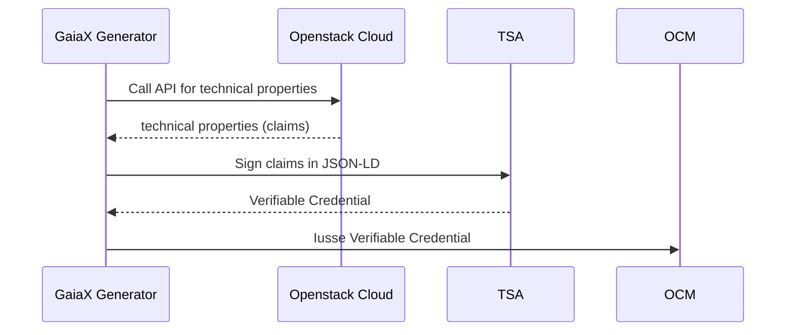

# Integration into Gaia-X Federation Services

This section descibes how SCS Gaia-X generatoir is integrated into [Gaia-X Federation Services Tool Stack](https://www.gxfs.eu/specifications/). Therewith, two services are important:

- Organisation Credential Manager (OCM)
- Trust Service API (TSA)

In Gaia-X, Participants describes themselves, their Service Offerings and Resources in a machine-readible way as [Gaia-X Credentials](https://gitlab.com/gaia-x/glossary/-/blob/main/docs/Gaia-X_credentials.md). A Gaia-X Credential is a set of [W3C Verifiable Credentials](https://www.w3.org/TR/vc-data-model/), i.e. cryptographically signed attestations about a Gaia-X entity. These credentials are stored in a secure digital wallet, called Organization Credential Manager [OCM](https://www.gxfs.eu/organizational-credential-manager/). OCM supports endpoints to issues and to get Verifiable Credentials. 

SCS Gaia-X generator discovers technical properties from Openstack clouds, such as available flavors and images and outputs them as claims in JSON-LD. These claims have to be stored as Verifiable Credentials in OCM. To output Verifiable Credentails instead of claims, Gaia-X SCS generator has to sign discovered technical properties. Signing capabilities are provided by a further GXFS tool, called [Trust Service API (TSA)](https://www.gxfs.eu/trust-services-api/). 

## Overall Architecture
SCS Gaia-X generator acts as organisation internal Conformity Assesment Body, who outputs Verifibale Credentials about techical poperties of Openstack Clouds and stores these credentials in OCM. To sign credentials, GXFS TSA is used.

 

## Workflow
The following diagram shows the dynamic behaviour of SCS Gaia-X Generator with OCM and TSA. 

In order to keep the credentials in OCM up-to-date, the process described above should be performed periodically. Currently, OCM does not support revocation or update of Verifiable Credentials. According to [OCM specification](https://www.gxfs.eu/download/1746/), each credential must have an expiration date. This date should match with the update cycle of the SCS Gaia-X generator.
