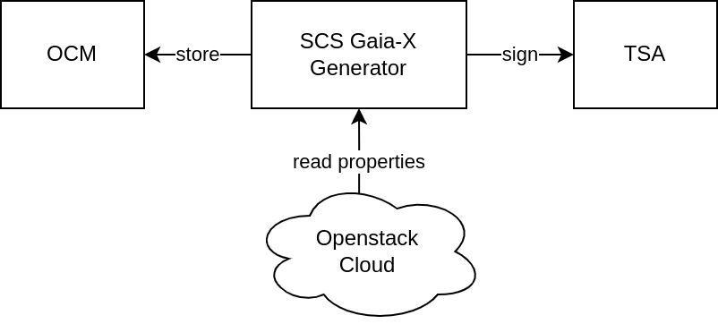
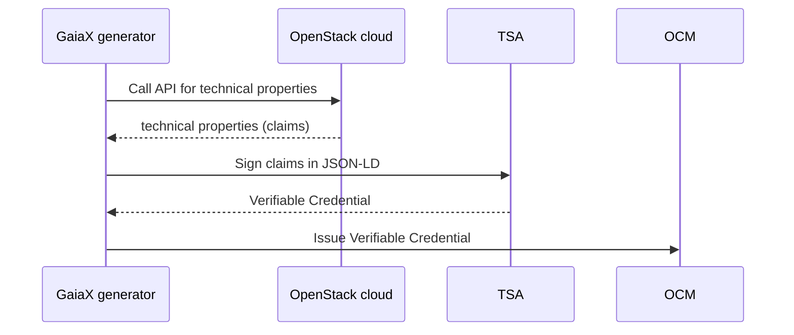

# Integration into Gaia-X Federation Services

This section describes how the SCS Gaia-X generator is integrated into the [Gaia-X Federation Services Tool Stack](https://www.gxfs.eu/specifications/). In this context, two services are important:

- Organisation Credential Manager (OCM)
- Trust Service API (TSA)

In Gaia-X, Participants describe themselves, their Service Offerings and Resources in a machine-readable way as [Gaia-X Credentials](https://gitlab.com/gaia-x/glossary/-/blob/main/docs/Gaia-X_credentials.md). A Gaia-X Credential is a set of [W3C Verifiable Credentials](https://www.w3.org/TR/vc-data-model/), i.e. cryptographically signed attestations about a Gaia-X entity. These credentials are stored in a secure digital wallet, called [Organization Credential Manager (OCM)](https://www.gxfs.eu/organizational-credential-manager/). The OCM supports endpoints to issue and to retrieve Verifiable Credentials.

The SCS Gaia-X generator discovers technical properties from an OpenStack cloud, such as available flavors and images, and outputs them as claims in JSON-LD. These claims have to be stored as Verifiable Credentials in the OCM. To output Verifiable Credentials instead of claims, the Gaia-X SCS generator has to sign discovered technical properties. Signing capabilities are provided by a further GXFS tool, called [Trust Service API (TSA)](https://www.gxfs.eu/trust-services-api/). 

## Overall Architecture
The SCS Gaia-X generator acts as organisation-internal Conformity Assessment Body, which outputs Verifiable Credentials about technical properties of OpenStack clouds and stores these credentials in the OCM. To sign credentials, the GXFS TSA is used.

 

## Workflow
The following diagram shows the dynamic behaviour of the SCS Gaia-X generator with the OCM and the TSA. 

In order to keep the credentials in OCM up-to-date, the process described above should be performed periodically. Currently, the OCM does not support revocation or update of Verifiable Credentials. According to the [OCM specification](https://www.gxfs.eu/download/1746/), each credential must have an expiration date. This date should match with the update cycle of the SCS Gaia-X generator.
